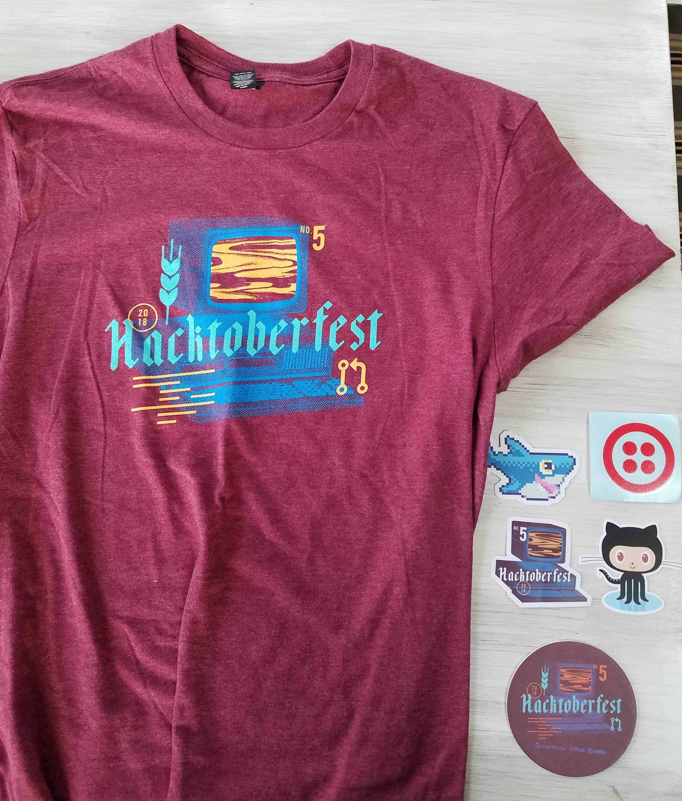

Whether you’re in your first year of coding or tenth, you’ve probably heard of the term “open source”. If you don’t know what it is, this definition from [opensource.com](https://opensource.com/) summarizes it perfectly:

> _Open source software is software with source code that anyone can inspect, modify, and enhance._

[Source](https://opensource.com/resources/what-open-source)

No black box here! Open source software is literally accessible for anyone to add to. This is great since developers can help in testing and creating features they would like to see in projects.

Showing that you contribute to open source shows employers that you can work well with other developers. Communication is key when pull requests (PRs) are reviewed and future enhancements are discussed. This kind of developer would be a welcome addition to any team.

My first experience in open source was doing [Hacktoberfest in 2018](https://hacktoberfest.digitalocean.com/). I saw the event mentioned in a newsletter and decided to see what it was all about.

Hacktoberfest encourages developers (aimed for newbies) to make at least 5 PRs in October. You sign up using your GitHub profile and it tracks PRs you open. I was able to get an awesome t-shirt and stickers from the event.

_Hacktober swag_

Since then I've contributed to [FreeCodeCamp](https://github.com/freeCodeCamp), [dwyl](https://github.com/dwyl), and [Gridsome](https://github.com/gridsome). I always get a sense of fulfillment when submitting a bug fix or even simply correcting spelling in the documentation. I was glad to take the time to help other people in improving their software.

If you enjoy working with a specific program, see if it's open source. You will be more motivated to work on projects that you use commonly.

You don’t need to understand the code to contribute, documentation fixes/additions are always encouraged.

There are a lot of resources online to help someone get into open source, here are a few I've looked at:
* [GitHub's list of projects that have a great reputation for new contributers](https://github.com/showcases/great-for-new-contributors)
* [Open Source Friday](https://opensourcefriday.com/)

Being a part of the open source community isn’t something you need to spend a lot of time on. It can take days, even weeks, to figure out just where one function is being used in the code, let alone how the whole thing works. Be patient with the code, and with yourself, you will get it. :)