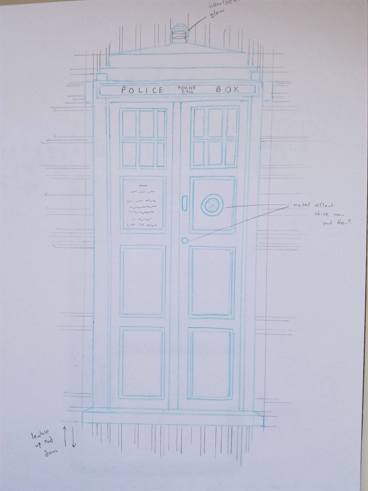
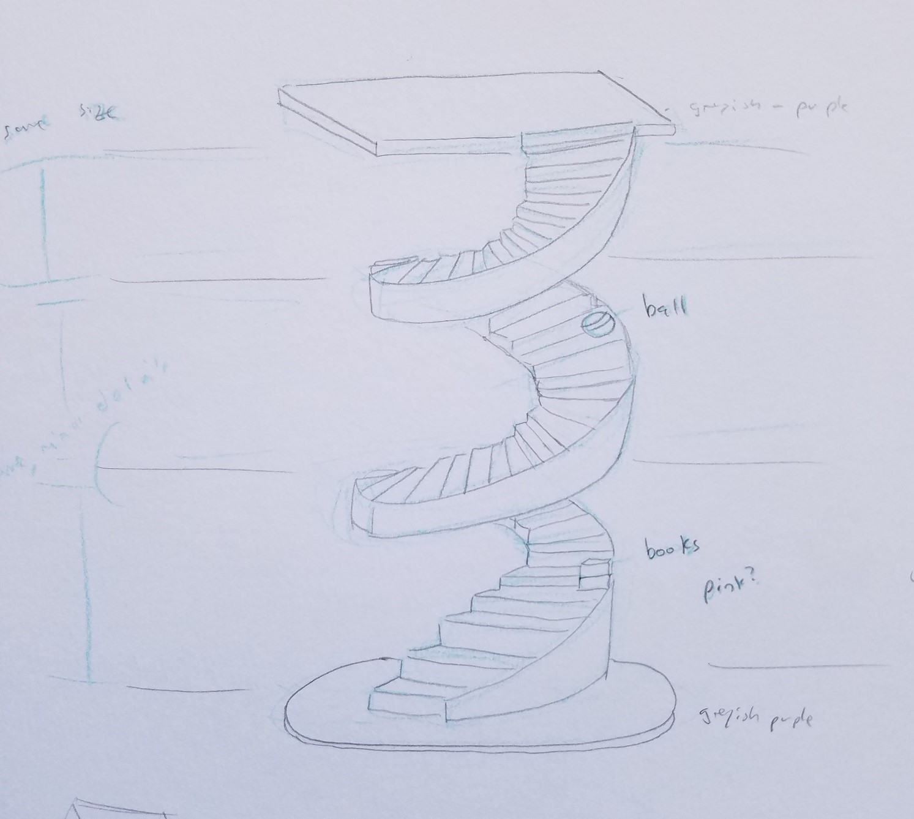
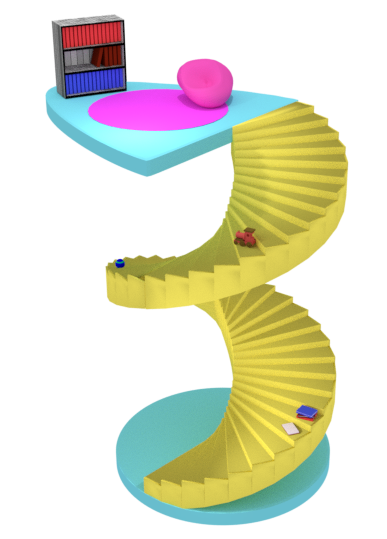
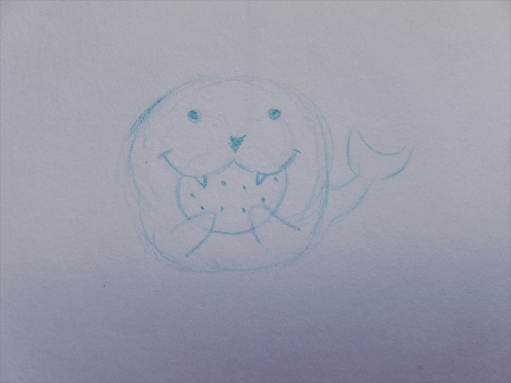
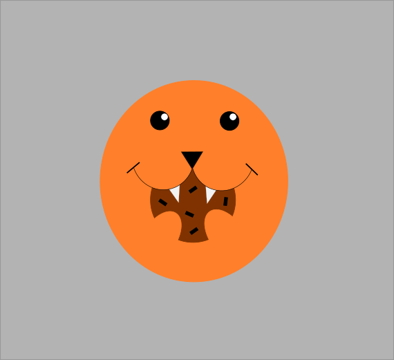

I find it incredibly satisfying to have my project ideas written down. Whether it be a sketchbook or regular notebook paper, you will have more clarity to see what you're trying to do.

Before I continue, I just need to point out to whomever is reading this thinking: 

_I can't draw! My stuff will look horrible!_ 

It's fine, unless you want to show them off, no one else needs to see your ideas on paper.

Since I work in front-end, I enjoy drawing out my ideas in a sketchbook specifically for my coding projects.

Below are some sketches I worked on for existing projects:

The TARDIS was something I thought a lot about. I know I was going to be using [CSS Grid](https://css-tricks.com/snippets/css/complete-guide-grid/) for it, but to take into account the details of the model, I decided to draw lines to indicate the various grids and how they intersect.

_Doctor Who's TARDIS_

The live project can be seen [here](https://distracted-jang-cfb752.netlify.com/).

Another project that is currently in progress (as of writing this) is using a 3D model I made in Blender for a "shift" effect when the user scrolls down the page. I love the use of the models on [Season 2 of Command Line Heroes](https://www.redhat.com/en/command-line-heroes/season-2) (great podcast by the way!) site page. As you scroll down the page, the pieces of the model shift apart.

_3D stair model sketch_

A rendered image made using [Blender](https://www.blender.org/) (free and open source):

_3D stair model render_

I downloaded [Inkscape](https://inkscape.org/) (free and open source) to learn how to make my own svgs. The favicon for this site was also made using Inkscape.

As you can see, my sketches are not very detailed. But that's ok, they serve their purpose. I just want to make the design process easier as I am working. 

_Cute critter eating a cookie sketch_

_Cute critter eating a cookie svg_

There are many developers (including me) who use design sites like [Dribble](https://dribbble.com/) for inspiration. Unless you have your thoughts written down, all of your ideas are just floating around in your head with everything else you have to do. It's most likely you'll forget them over time.

Creating a website layout from scratch can be pretty overwelming, take some of the pressure off by sketching your ideas whenever lightning strikes. Your future self will thank you.

