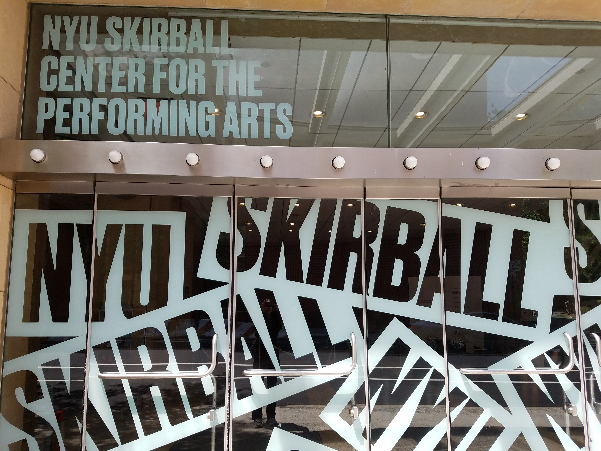
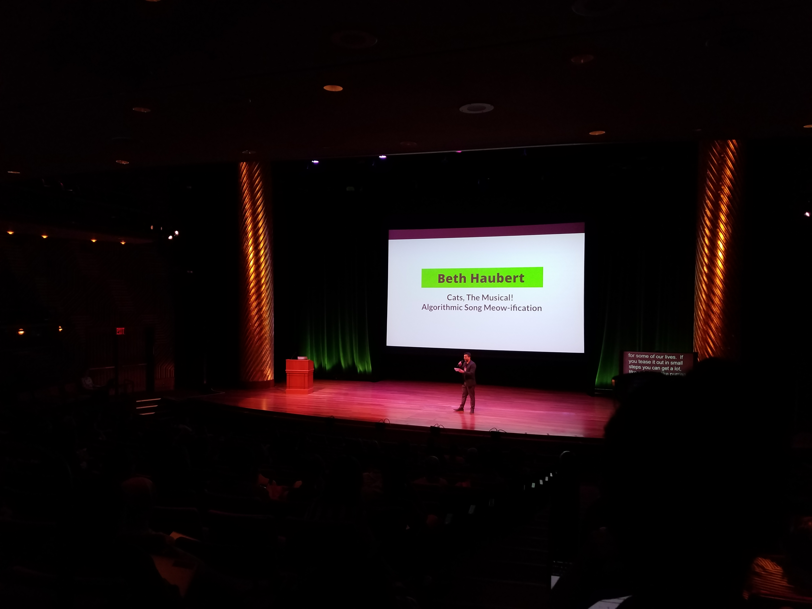

I recently attended Codeland in NYC. I was super pumped to meet with new developers at an event that is known to have such a welcoming and enthusiastic community.

I only signed up for the talks so that is what this article will be about.

---

Unfortunately, I took _very few_ images while I was there so this will be mostly a text-filled post.

This image was from one of the entrances into Codeland.

_Entrance to Skirball Center for the Performing Arts_

## How I Created 'We Read Too', a Mobile Directory of Diverse Books

_Kaya Thomas, @kthomas901_

The first talk was by Kaya Thomas, an iOS engineer, who presented her mobile app called "We Read Too". The app is an extensive list of books featuring authors and main characters of color. Kaya’s project is so inspiring to me because, like how many ideas start, she realized something was wrong with how many popular/best seller YA books are mostly consisted of white characters as the protagonist. Seeing a lack in more diverse representation being recognized, Kaya concocted a list of books that would encourage others to read stories that had characters that they could more relate to in terms of racial diversity. This list grew as she introduced the app to friends and family, recommendations can be offered to anyone through the app itself.

Something I took away from this lecture is that even if something isn’t perfect, ship it. There will always be time to fix or enhance the app once it’s out for the public to view and test.

If you’re interested in Kaya’s app, you can check it out [here](https://wereadtoo.launchaco.com/).

---

## How to Fail Without Being a Loser

_Katrina Owen, @kytrinyx_

Even before Katrina came on stage, I knew I was going like this talk just from the title alone. Honestly, I think anyone in tech needs to hear what she has to say. Katrina delved into the stages of going through a project and the many situations where you can eventually come up short as you persist. 

There were 3 parts where failure could happen:
- the beginning of when you have an idea but you never even start acting on it
- the middle when you have consistency in your work, but the drive eventually peters out
- the end where you don’t stop (yes, this could be a bad thing)

She included various stories from when she worked on her project [Exercism.io](https://exercism.io/). I also appreciated her busting some famous “Instagramish” quotes that you hear about success like “you should never quit” because it gives such a societal pressure to “keep at it” even if you aren’t happy in what you’re doing. If something is bad or even dangerous you should quit, enough said.

---

## Guide to Your Own Artificial Intelligence Application in 3 Easy Steps

_Norah Klintberg Sakal, @norahsakal_

For someone like me that knows pretty much nothing about what goes into using artificial intelligence, I found Norah’s presentation extremely informative. Her program was created to help a user select a cosmetic tutorial on YouTube based on someone’s specific eye shape. She broke her program down into steps where she took test data of celebrity’s eyes and used math techniques like elementwise multiplication to identify which eye shape the program was viewing in each image.

She even ran the program for us on her own face and showed us a condensed list of videos that matched her eye shape. That sure beats scrolling through the hundreds of videos yourself.

---

## Med to Dev: My Journey Through Depression

_BJ Burns, @bowtiebeej_

This talk wasn’t as much about technology as it was about BJ’s experience with depression and his journey. I was very relieved to have such a deep and emotional topic like depression at a technical conference. When we think of developers, we think of what they know, what they can produce, what they can create for others, but not always considering them for their emotions (at least not in some job interviews). His talk was very motivating for anyone that has ever been in a dark place in their coding journey.

I for one, have had moments of doubt when I compare myself to others (by the way, don’t ever do this). I find reading articles about other developers of all levels posting their experiences with burnout or imposter syndrome makes me feel that I am not alone.

---

## Cats the Musical! Algorithmic Song Meow-ification

_Beth Haubert, @haubertdashery_

_Beth Haubert about to begin her talk_

This was an interesting topic for sure. Beth presented her app ‘Meowifier’ which converts songs into cat meows. We were given a mass of knowledge of how to process melody with code to decide how to replace each note with the appropriate ‘meow’ response. Despite how silly this project may sound, I found the idea very fun and unique. It just reminds me that not everything I code has to be the next big tool or program. Even if the only user is you, it still is worth to build something that helps expand your skillset. Plus, I imagine this kind of fun app would be interesting to talk about in a job interview.

---

## Yes, You Should Write That Blog Post

_Ali Spittel, @aspittel_

When I first joined [Dev.to](https://dev.to/), I immediately saw Ali’s posts showing up in the feed. Since then, I’ve been following her writing. One of the first articles I read was about blogging itself like [Blogging as a Developer](https://dev.to/aspittel/blogging-as-a-developer--5h0m) to motivate myself to just start creating my own posts. Ali’s talk was about the challenges she faced during her journey as a blogger: the fears (like disrespectful messages), the rewards (learning new things), and how to push on and keep going. Ali gave us a timeline from when she first started blogging about tech and all the times she’s stopped. I guess what I took from this presentation the most was to just keep at it. Blogging should be about writing for your past self, what the previous you would’ve liked to google and find to help solve a problem you once had. In time, you can use your writing to establish yourself as an expert too.

---

## Building a Gendered Dictionary

_Omayeli Arenyeka, @yellzheard_

Do you think language is sexist? Yes? No? Maybe? Well Omayeli claimed it did and created The Gendered Project to prove it. She showed us the steps to taking an existing data set of gendered words (like king and queen) to analyze and show how sexist our language in fact is. She introduced various topics that went into her project like word vectors which uses numbers to identify the meaning of a word and how she used Regular Expressions (Regex) to express her findings. I think this project was quite ingenious. Omayeli not only created a project that was for a topic that mattered to her, but it can be used to question our current language and stamp out the blatant sexism that it encompasses (like ball-buster).

---

## Coding the Crossfade

_Michael Winslow_

I had no idea what “crossfade” was until this talk (shows you how often I go to clubs). Michael presented his program that would solve the issue of transitioning smoothly between songs as the first one fades away and the next one plays louder. Like Beth’s ‘Meowifier’ talk, I was amazed at the use of coding to control music in matching beats to replicate the use of an actual DJ at the club. At the end of his talk, Michael stressed the importance of how powerful developers are. We all get frustrated with how something could be better (like the song transition problem he was facing), but it’s the coders who think about how the problem can be solved and go about creating a solution.

---

## Art Meets Algorithms

_Kristen Webster_

I was very impressed by Kristen’s talk on using algorithms to create new art from existing pictures. Each image’s alteration is formed by a single line using the Traveling Salesman Problem (TSP) which delves into finding the shortest route between a series of points and not landing on any of the points more than once. Even after implementing a working program, Kristen noticed that she could improve the results by applying the 2-Opt algorithm in order to avoid long lines showing in the images when the program calculated the path.

It’s really quite fascinating how coding can be a part in creating art. I plan to dive into HTML Canvas myself to get into incorporating code with creating art.

[Kristen's case study.](http://www.kristenwebster.net/projects/algorithmic-art-case-study.html)

[Here is some of the art she created with her program.](http://www.kristenwebster.net/projects/algorithmic-art-gallery.html)

---

## An Immigrant’s Journey into Tech

_Jo-Wayne Josephs, @jojosephs1992_

Jo-Wayne shared her journey and background getting into tech while being an immigrant from the Caribbean. It was a long process that depended on many factors. Jo-Wayne requested asylum to stay in the U.S. due to not feeling safe if she returned to the Caribbean. Not having to think about this for myself, I didn’t realize the stressful obstacles one has to endure to stay in the country. I believe it is too difficult to become a citizen in the U.S. Considering there will be more tech jobs available than people to fill them, it certainly makes sense for an immigrant to obtain a technical skill that could give them a fighting chance to gain employment and be able to live in the U.S.

---

I am so glad to have witnessed these speakers and be present at Codeland. I’ve learned so much and look forward to next year's conference.

If you're interested in attending Codeland, you can stay up to date with their [newsletter](https://codelandconf.com/).

[Found a typo or problem? Edit this page.]()