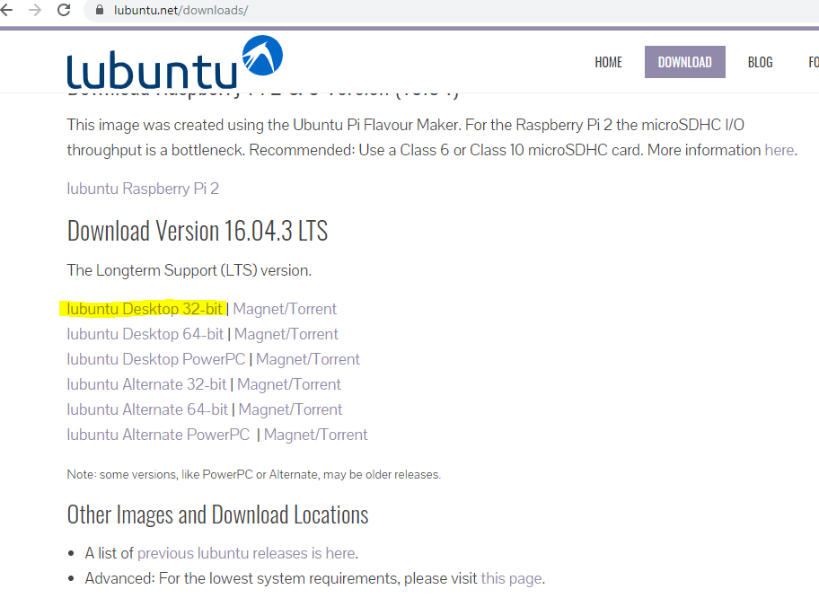
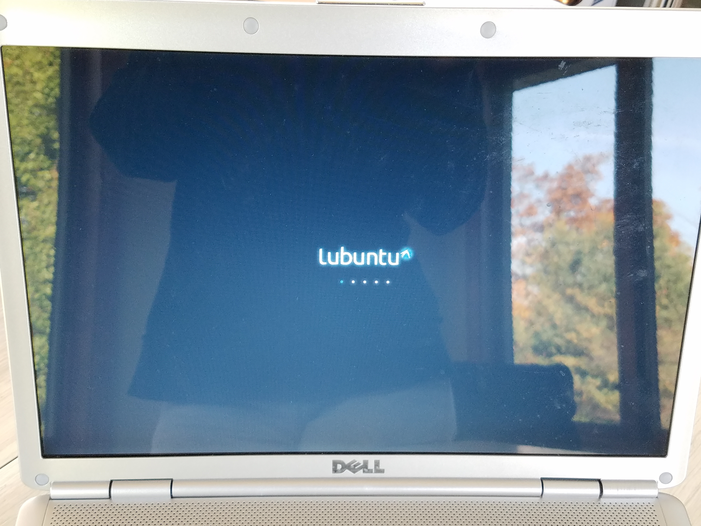
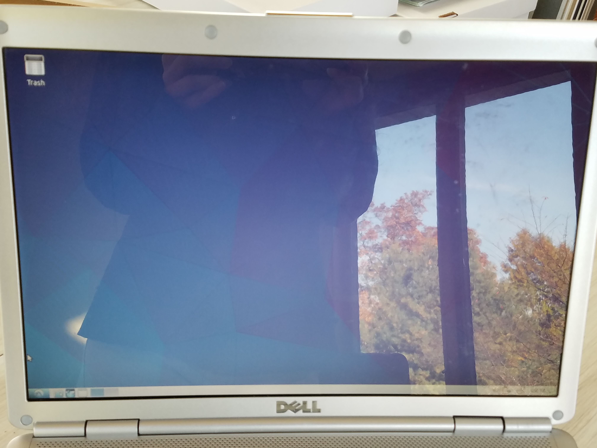
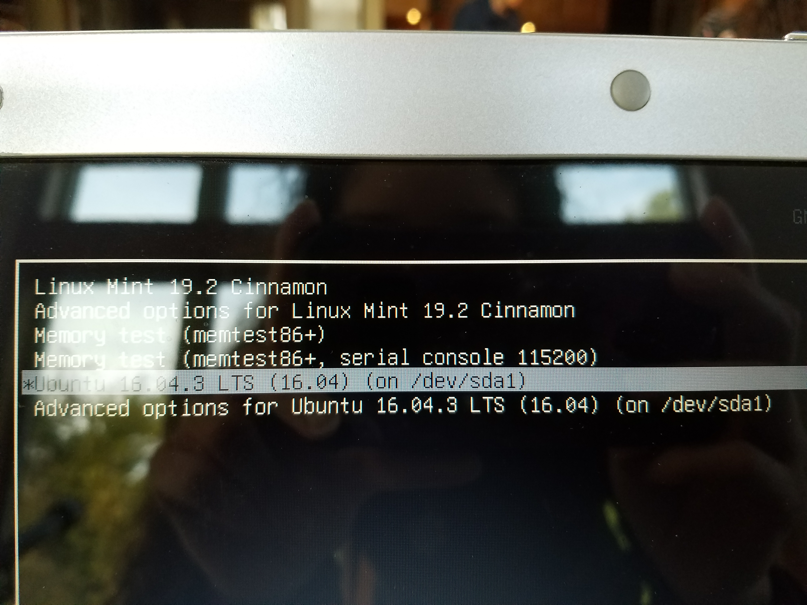

_Keep in mind as you read this post, I hardly considered documenting this process as I started. Thinking that someone reading this could benefit from my experience, I tried my best to remember everything I could._

I've always used Windows. There really was no reason. It's just that the computers I've owned came with it and it's what I knew how to use the most. My knowledge with Linux was so small it was negligible. I only knew that it was open source and there were many different kinds to choose from (known as "distributions" or "distros").

So, why the interest now? Well, I was looking into Docker and came to the quick realization that I couldn't use it on Windows 10 Home, which I had :disappointed:. It got me to thinking what other restrictions did I have using a propriety OS? What _was_ Linux all about? It seems Docker works on it just fine. How easy is it to get my hands on the OS for a newbie like me? This post documents my first time experimenting with Linux.

I knew I didn't want to test Linux on my current working computer. It was going to be used in my new job soon and I did not want to mess around with it.

While researching Linux on YouTube, I came across one of Chris Titus's videos on installing [Linux on an old laptop](https://www.youtube.com/watch?v=21TFcUIPlS0). I was intrigued. I still had my very first laptop collecting dust in a shelf and thought it could be of some use. The computer was a 32-bit running Windows Vista with 2 GB of RAM available.

After opening it up and making sure that there was nothing needed to back-up on it. I decided to follow Chris's video and install [lubuntu](https://lubuntu.net/).

## Getting the ISO file

My first task was to download the ISO file on the [lubuntu website](https://lubuntu.net/downloads/).

I chose to download **lubuntu Desktop 32-bit**.

_lubuntu downloads page_

Okay, so what is an ISO file?

> _An ISO file, often called an ISO image, is a single file that's a perfect representation of an entire CD, DVD, or BD. The entire contents of a disc can be precisely duplicated in a single ISO file.
> Think of an ISO file like a box that holds all the parts to something that needs to be built — like a child's toy you might buy that requires assembly. The box that the toy pieces come in does you no good as an actual toy but the contents inside of it, once taken out and put together, become what you're actually wanting to use.
> An ISO file works in much the same way. The file itself is no good unless it can be opened, assembled, and used._

[Source](https://www.lifewire.com/iso-file-2625923)

I couldn’t just use an ISO file to install lubuntu on my computer. I had to use a program with the ISO file to make a bootable usb to implement the OS. I made sure the usb was empty before the next step.

## Creating a bootable usb

I followed these [instructions](https://www.instructables.com/id/Install-any-linux-from-a-usb-the-easy-way/) for creating the bootable usb. I'm not going to reiterate the instructions here because the author did a good job and I had no trouble in following.

Once my usb was prepped for use, I needed to look into how the computer looks for the usb for a new OS to install.

## Installing lubuntu

I needed to access the BIOS on my computer. I never had to go into this before so I had to google how to access it (for me, it was the F2 key). The reason you need to access the BIOS is because you need to change the order of where the computer searches for the OS to load. I set the usb first in the list and made sure to save while exiting the BIOS.

I looked at the [documentation on Linux Mint website](https://linuxmint-installation-guide.readthedocs.io/en/latest/boot.html) to make sure I did this properly, even though I wasn't using Linux Mint, it was the same process. It seemed I needed to time it properly to access the BIOS after I restarted my computer.

If this is done right, the computer will prompt you that it detects a new OS on your usb. You need to select it and hit enter.

Here's the interesting thing, I heard that I could have 2 operating systems on my computer, but I didn't realize it was as easy as an option when installing lubuntu. I was asked if I wanted to install lubuntu alongside my current OS (Windows Vista). Since I wanted to follow Chris's video, I chose a full override.

After completing the menu questions, I left the computer to do its thing.

_lubuntu loading screen_

I know, the images have a huge glare. But there's not much I can do about that.

Once it finished, the lubuntu desktop was showing and I was all done! :smile:

_lubuntu desktop_

A few things to note when I went through this installation:

- There were a lot of terminal messages showing on the screen. I didn't think I had to press anything so I just waited it out.

- I don’t recall seeing a request to remove the usb at any point, so I removed it when the installation finished and the new desktop showed.

- During the installation, I was asked to create a login account. I _believe_ this was during the menu questions since I needed to login when the installation was done.

- If I did this whole process again, it would've taken me 30 min _max_. I was just extra cautious during each step so I didn't mess anything up.

- If you choose the dual-OS option, you will be prompted to select which OS you want to load up. Lubuntu _may_ be labeled as "Ubuntu" next to the version you installed. I installed Linux Mint alongside lubuntu later on (will be in a future post) so I knew that whichever distro didn't have Mint in the name must have been lubuntu.

_Select distro options on computer start_

So this began with my frustration with Docker on Windows, and ended with me having successfully installed Linux for the first time on a forgotten computer. Considering my interest in Linux was always _this is something I'll eventually look into_, I'm glad I finally got around to it.

Resources:

- [Chris Titus's channel page](https://www.youtube.com/channel/UCg6gPGh8HU2U01vaFCAsvmQ)

- [lubuntu](https://lubuntu.net/)

- [It’s FOSS](https://itsfoss.com/)

[Found a typo or problem? Edit this page.](https://github.com/Dana94/website/blob/master/blog/2019-10-20-first-experience-with-linux.md)
