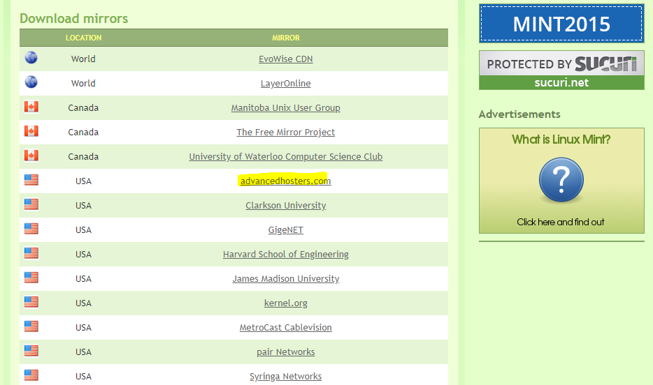
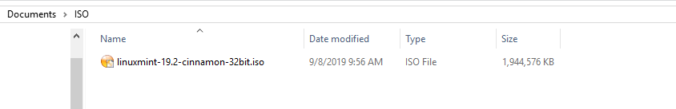
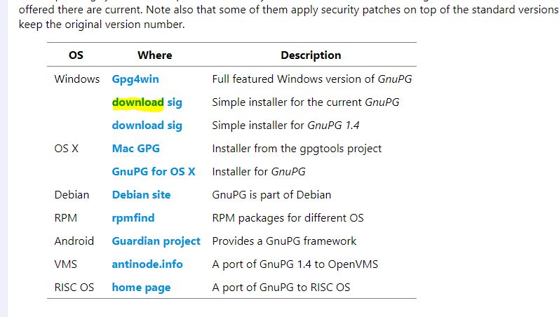
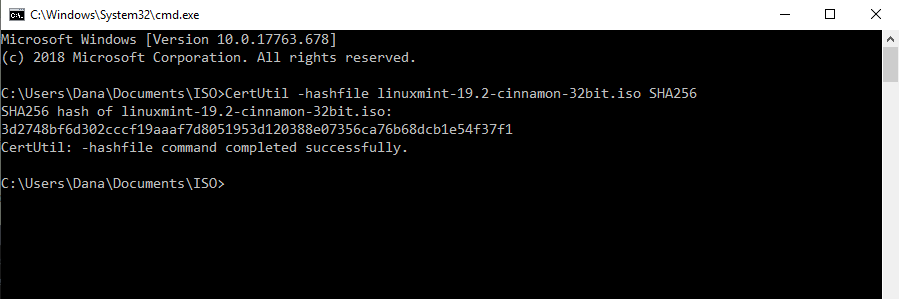
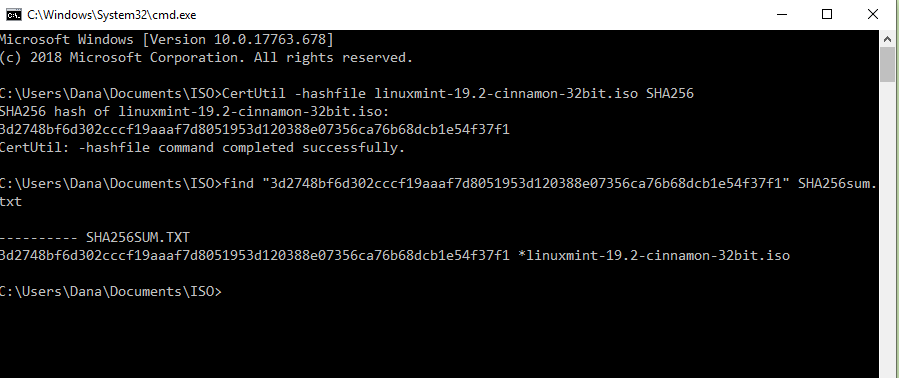
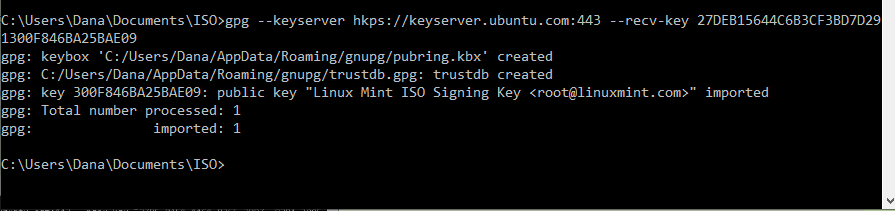
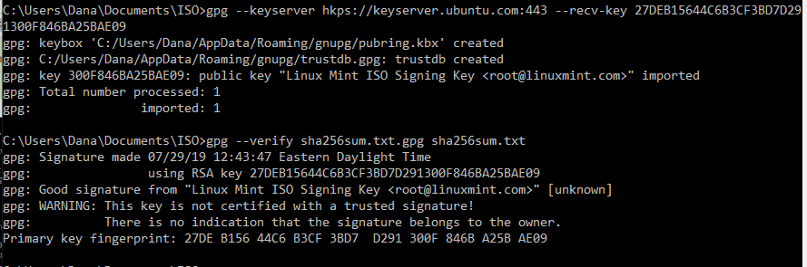
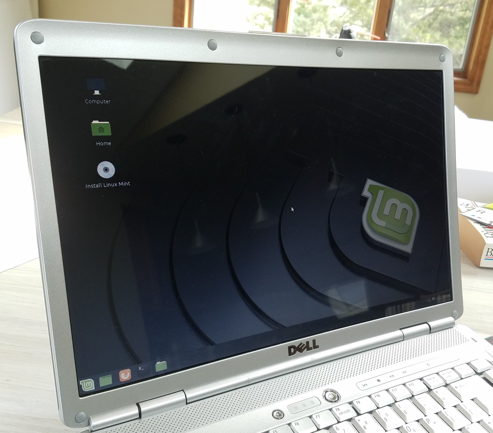
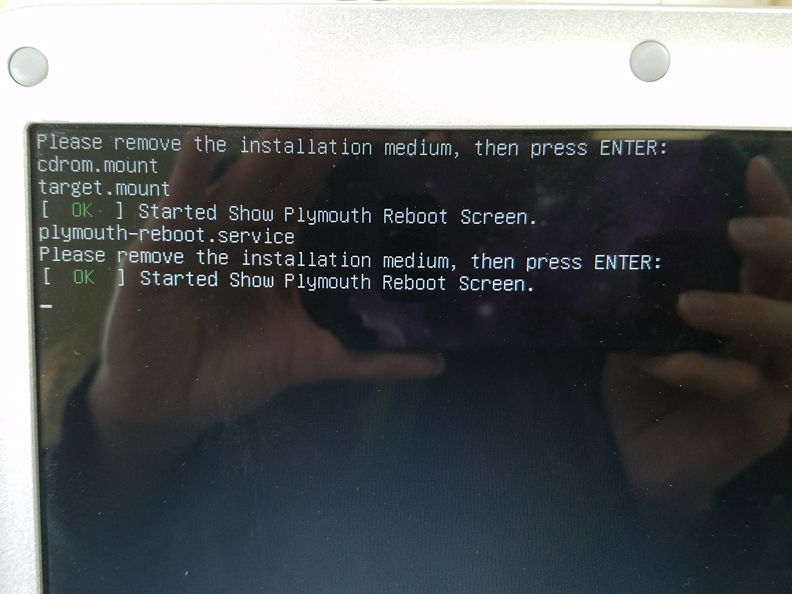

[After installing lubuntu on my old computer](/first-experience-with-linux), I decided to install a popular Linux distro: Linux Mint. I heard that it's similar to the Windows layout and wanted to see for myself.

Unlike the previous post, you'll notice I was ready to document this. 😉

## Create the bootable USB

First thing I had to do was download the mirror from this [page](https://linuxmint.com/edition.php?id=267). This was the first time I encountered mirrors and had no idea what they were. After looking at some forums, it seems my best bet was to just download the ISO file from the first of the 16 choices for USA mirrors. It took about 20 min for the file to download.

I’m still not entirely sure why they are called "mirrors".

The one I went with was from "advancedhosters.com".


_Mirrors to download on Linux Mint website_

## Verify the ISO file

This step was not something I did when installing lubuntu. Linux Mint strongly suggests checking to make sure the ISO downloaded has not been corrupted.

I followed the instructions from Linux Mint and then these [verification steps for Windows](https://forums.linuxmint.com/viewtopic.php?f=42&t=291093).

I created a folder called "ISO" and put the file in it.


_Folder created for ISO file_

Make sure to _right click and save the files_, I didn't read the instructions and had to do this step again.


_Files to add to your folder_

Download the installer. I chose the first "download sig" for Windows.



For help in copy and pasting in the terminal for Windows, I looked at [this](https://www.bonkersabouttech.com/howto/how-to-copy-and-paste-in-cmd/468).

Open your terminal in the ISO directory and run this command:
```shell
CertUtil -hashfile filename.iso SHA256
```



This took less than 1 min to finish.

There will be a hash given that is meant to be compared to the one in your ISO file to ensure that they are the same.

You could check them in the terminal.

```shell
find "hash-from-previous-step" sha256sum.txt
```

Of course, replace the hash you received in the quotations.



If the hash wasn't found then the integrity check was not passed. DO NOT use this ISO file.

## Authenticity Check

Yep, we have to do both an _integrity_ and _authentication_ check.

From the [instructions](https://forums.linuxmint.com/viewtopic.php?f=42&t=291093) there were 3 different commands you could use for ths step. The first one worked for me.

```shell
gpg --keyserver hkps://keyserver.ubuntu.com:443 --recv-key 27DEB15644C6B3CF3BD7D291300F846BA25BAE09
```



```shell
gpg --verify sha256sum.txt.gpg sha256sum.txt
```



I received a "Good Signature" message and as the post advises, I can ignore the warning message that came after.

Phew, with the ISO passing both integrity and authentication, it's time to create a bootable USB (finally).

## Create bootable USB

I follow [Linux Mint's instructions](https://linuxmint-installation-guide.readthedocs.io/en/latest/burn.html) and used [Etcher](https://etcher.io/) for this step.

## Installing Linux Mint

I followed the instructions for [booting Linux Mint](https://linuxmint-installation-guide.readthedocs.io/en/latest/boot.html) and the [installation options](https://linuxmint-installation-guide.readthedocs.io/en/latest/install.html) right from their website.
After inserting the USB, you will get a "live session" of Linux Mint. The OS hasn't been installed yet, this is sort of a "testing area" so you could preview what you intend to install. There will be a installer on the desktop when you decide to use it. 


_Linux Mint home screen_

This is the step for opting for the dual os route. So I will have both lubuntu and Linux Mint side by side and can decide which oe I want to use once I start my computer.


_Dual OS option_

This step shows only if you decide to install Linux Mint alongside your current OS. You can choose how much space each OS can take up on your hard drive.

Ubuntu 16.04.3 is lubuntu.


_Partition option_

Unlike when I installed lubuntu, I knew when to remove my USB when this message came up.


_Remove USB message_

All in all, I found the instructions on Linux Mint website extremely well documented.