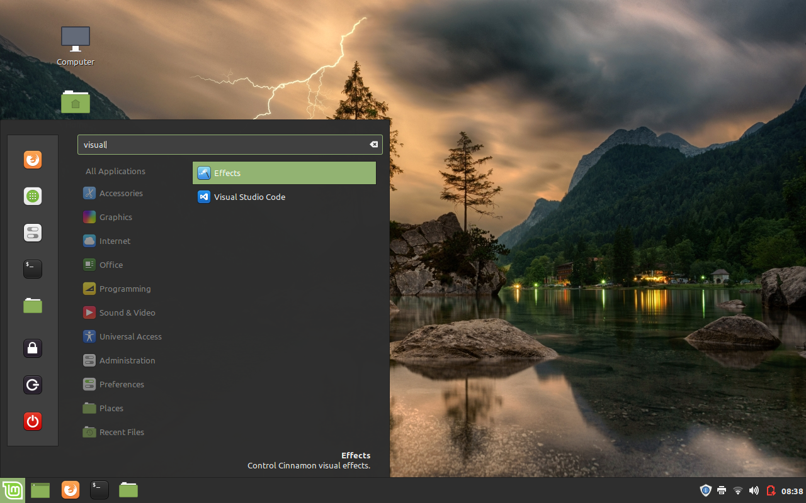
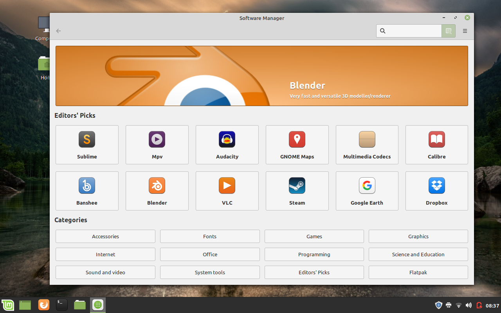

Once I [installed Linux Mint](/installing-linux-mint), I tried to install 2 programs just to learn how it's done in Linux. I know it's not as easy as running an executable, so this is what this post is about.

I learned how to install 2 programs 2 different ways:
- with a debian file
- through Snap

## Installing Visual Studio Code

I installed this program using a debian file.

If you don't know what a debian file is (like me), here is this description from Wikipedia:

> _Debian packages are standard Unix ar archives that include two tar archives. One archive holds the control information and another contains the installable data._

[Source](https://en.wikipedia.org/wiki/Deb_%28file_format%29)

The [Visual Studio Code website](https://code.visualstudio.com/) does have a Linux download option, but not for 32-bit. I had to search until I came to this [forum question](https://askubuntu.com/questions/616797/can-i-install-visual-studio-code-on-ubuntu-32-bit) that inquired about the same thing. This is where I found [this page for the 32-bit](https://code.visualstudio.com/Docs/?dv=linux32_deb).

Once that downloaded, I had to look up how to use this file to install the program. I found [this page on installing with a debian file](https://www.tecmint.com/install-local-deb-packages-in-debian-ubuntu-linux-mint/) and used the first command option to install VS Code.

```shell
sudo dpkg -i code_1.35.1-1560349847_i386.deb
```
When this command finished, I was able to find the program by searching in the start manager and running it from there.


_VS Code in launcher_

## Installing Notepad++

I installed this program using Snap.

I went onto the website for Notepad++ to download it, but I wasn't sure which option was right for 32-bit Linux. So the next best thing was to just search for it. I came across this [post on FOSS for installing Notepad++](https://itsfoss.com/notepad-plus-plus-linux/). The process was obviously different from the way I installed VS Code. Instead of a debian file, I had to install Snap before installing Notepad++.

So what is Snap? Of course, FOSS site has a description for it:

> _Snaps are basically an application compiled together with its dependencies and libraries – providing a sandboxed environment for the application to run. These are easier and faster to install, can receive latest updates and is confined from the OS and other apps._

[Source](https://itsfoss.com/install-snap-linux/)

So Snap is a solution to installing a program on any Linux distribution without having to worry about compatibility. Cool!

So I first needed to install Snap.

```shell
sudo apt install snapd
```

Then install the program I want.

```shell
sudo snap install notepad-plus-plus
```

Once this was installed, I expected to see it in the start menu, but couldn't find it. Instead of restarting my computer, I just ran it from the terminal.

```shell
notepad-plus-plus
```

There was a minor issue showing in the terminal regarding not finding Wine installed. Notepad++ actually uses Wine (a program used for running Windows apps on Linux) to work on Linux. I didn't install Wine previously, but since running Notepad++ still uses Wine in itself, it continued loading up the application successfully.

## Note:

In Linux Mint there is a software manager that I could've used to install these programs but I wanted to learn how to install through manual processes instead.


_Software manager_

So unlike a typical Windows installer, there are a few ways someone can install a program on Linux. For a beginner like myself, it takes a bit of searching to understand what works best. Luckily, there are many well written instructions out there to guide someone through this set-up.

Resources:

- [Visual Studio Code Website](https://code.visualstudio.com/)

- [Visual Studio Code for 32-bit](https://code.visualstudio.com/Docs/?dv=linux32_deb)

- [Can I install Visual Studio Code on Ubuntu 32 bit?](https://askubuntu.com/questions/616797/can-i-install-visual-studio-code-on-ubuntu-32-bit)

- [3 Command Line Tools to Install Local Debian (.DEB) Packages](https://www.tecmint.com/install-local-deb-packages-in-debian-ubuntu-linux-mint/)

- [deb (file format)](https://en.wikipedia.org/wiki/Deb_%28file_format%29)

- [Notepad++ on Linux is a Reality Thanks to This Snap Application](https://itsfoss.com/notepad-plus-plus-linux/)

- [How to Install and Use Snap in Various Linux Distributions](https://itsfoss.com/install-snap-linux/)

[Found a typo or problem? Edit this page.](https://github.com/Dana94/website/blob/master/blog/2019-11-30-installing-programs-on-linux.md)
