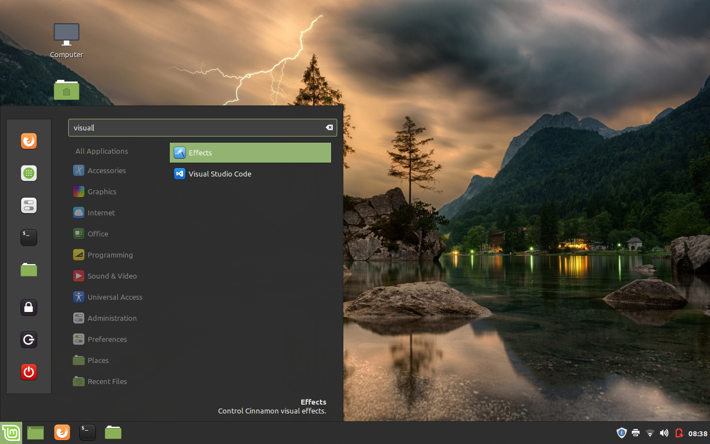

Once I [installed Linux Mint](/installing-linux-mint), I tried to install 2 programs just to learn how it's done in Linux. I know it's not as easy as running an executable, so this is what that post is about.

I learned how to install programs 2 ways: through a package and a debian file.

## Installing Visual Studio Code

I installed this program using a debian file.

The [Visual Studio Code website](https://code.visualstudio.com/) does have a Linux download option, but not for 32-bit. I had to search until I came to this [forum question](https://askubuntu.com/questions/616797/can-i-install-visual-studio-code-on-ubuntu-32-bit) that inquired about the same thing. This is where I found [this page](https://code.visualstudio.com/Docs/?dv=linux32_deb) for the 32-bit.

Once that had downloaded, I had to look up how to use this file to install the program. I found [this page](https://www.tecmint.com/install-local-deb-packages-in-debian-ubuntu-linux-mint/) and used the first command option to install VS Code.

```shell
sudo dpkg -i code_1.35.1-1560349847_i386.deb
```
When this command finished, I was able to find the program by searching in the start manager and running it from there.


_VS Code in launcher_

## Installing Blender


## Note:

In Linux Mint there is a software manager that I could've used to install these programs but I wanted to learn how to install through the program's website instead.


_Software manager_

## Resources:

- [Visual Studio Code Website](https://code.visualstudio.com/)

- [Visual Studio Code for 32-bit](https://code.visualstudio.com/Docs/?dv=linux32_deb)

- [Can I install Visual Studio Code on Ubuntu 32 bit?](https://askubuntu.com/questions/616797/can-i-install-visual-studio-code-on-ubuntu-32-bit)

- [3 Command Line Tools to Install Local Debian (.DEB) Packages](https://www.tecmint.com/install-local-deb-packages-in-debian-ubuntu-linux-mint/)

[Found a typo or problem? Edit this page.]()