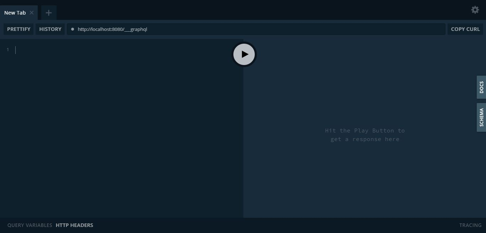
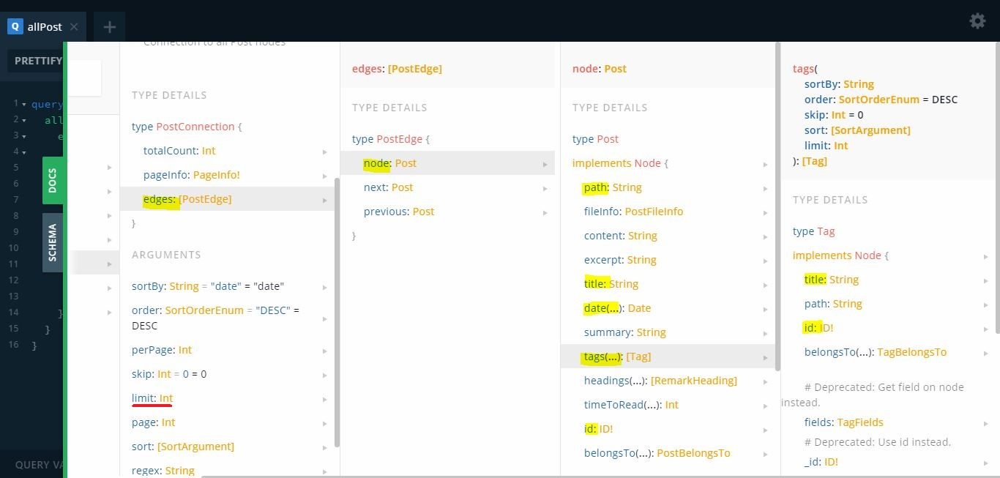
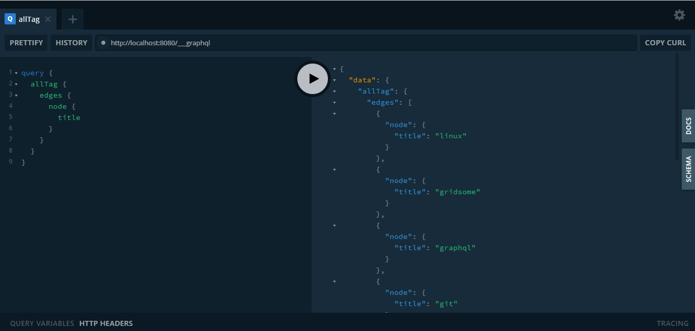

This post has a small intro to what GraphQL is and how it can be used in the "playground" where you can query for data and test it out yourself. I also use [Gridsome](https://gridsome.org/) in the playground section since it's one of the first occurrences I had with the language and I remember being a bit confused on how to understand the schemas available. I struggled when I first tried to play with the API on my own, so I hope this could clarify the same confusion for someone else.

## In short: What is GraphQL?

GraphQL is a query language that makes it easier to specify the data you need from the API you are calling. Unlike when you call REST APIs, you have to receive all the data instead of only what you want (we'll see this in action in the playground section).

You can only use GraphQL to query data from APIs that are _built_ to be used with GraphQL. This is because the data in these kinds of APIs are structured with types and fields.

## Playground

If you are using Gridsome, run your project with `yarn develop`. You will see 2 links for where the site is running at and for how to view the GraphQL playground to query your data.


_Gridsome develop and playground links_

Following the link, you'll see this interface, known as the "GraphQL playground".


_GraphQL playground_

Here you can practice querying your data with different parameters. There is a reference available in the right side under "docs" where you can see the sort of data you can query.

### Count all posts

Using this query, the information for all the posts in your Gridsome project will be shown. If you don't have any posts, then you may not receive any. The image's results are specific to my posts.

```js
// query
query {
  allPost {
    totalCount
  }
}
// result
{
  "data": {
    "allPost": {
      "totalCount": 11
    }
  }
}
```


_Count all posts_

### Use a parameter when querying data for posts

Depending on your query, you can pass in parameters to filter out the data you're looking for. In this example, I added a `limit` to only show 3 posts.

```js
// query
query {
  allPost(limit: 3) {
    edges {
      node {
        title
        path
        date
        tags {
          title
          id
        }
        id
      }
    }
  }
}
// result
{
  "data": {
    "allPost": {
      "edges": [
        {
          "node": {
            "title": "GraphQL in Gridsome",
            "path": "/graphql-in-gridsome",
            "date": "2019-12-23T00:00:00.000Z",
            "tags": [
              {
                "title": "graphql",
                "id": "graphql"
              },
              {
                "title": "coding",
                "id": "coding"
              },
              {
                "title": "vue",
                "id": "vue"
              },
              {
                "title": "gridsome",
                "id": "gridsome"
              }
            ],
            "id": "4de71dc286c30258c6528611a05a4a19"
          }
        },
        {
          "node": {
            "title": "Installing Programs on Linux 🐧",
            "path": "/installing-programs-on-linux",
            "date": "2019-11-30T00:00:00.000Z",
            "tags": [
              {
                "title": "linux",
                "id": "linux"
              }
            ],
            "id": "7a1c542009b1533f107bfde17067a78a"
          }
        },
        {
          "node": {
            "title": "Installing Linux Mint 🐧",
            "path": "/installing-linux-mint",
            "date": "2019-11-17T00:00:00.000Z",
            "tags": [
              {
                "title": "linux",
                "id": "linux"
              }
            ],
            "id": "2959471cb8c809de3405fd82f0909ebd"
          }
        }
      ]
    }
  }
}
```

In order to understand how I knew what data was available to query, I looked in the docs under the type of `allPost` which is `PostConnection`.


_Doc of query for posts_

The examples I've shown are really the basics of how to use GraphQL in the playground. The following are a few more examples for guidance.

### Query tag titles

```js
// query
query {
  allTag {
    edges {
      node {
        title
      }
    }
  }
}
// result
{
  "data": {
    "allTag": {
      "edges": [
        {
          "node": {
            "title": "linux"
          }
        },
        {
          "node": {
            "title": "gridsome"
          }
        },
        {
          "node": {
            "title": "graphql"
          }
        },
        {
          "node": {
            "title": "git"
          }
        },
        {
          "node": {
            "title": "blender"
          }
        },
        {
          "node": {
            "title": "art"
          }
        },
        {
          "node": {
            "title": "vue"
          }
        },
        {
          "node": {
            "title": "coding"
          }
        },
        {
          "node": {
            "title": "frontend"
          }
        }
      ]
    }
  }
}
```


_Query tag titles_

## Sort posts by title in descending order

Using 2 parameters here, I listed all the posts and ordered them in descending order according to their titles.

```js
// query
query {
  allPost(sortBy: "title", order: DESC) {
    edges {
      node {
        title
        date
      }
    }
  }
}
// result
{
  "data": {
    "allPost": {
      "edges": [
        {
          "node": {
            "title": "Why I Draw My Ideas",
            "date": "2019-07-19T00:00:00.000Z"
          }
        },
        {
          "node": {
            "title": "Styling In VueJS",
            "date": "2019-06-23T00:00:00.000Z"
          }
        },
        {
          "node": {
            "title": "My first experience with Linux (installing lubuntu) 🐧",
            "date": "2019-10-20T00:00:00.000Z"
          }
        },
        {
          "node": {
            "title": "My First Tech Conference – Codeland 2019",
            "date": "2019-07-27T00:00:00.000Z"
          }
        },
        {
          "node": {
            "title": "Installing Programs on Linux 🐧",
            "date": "2019-11-30T00:00:00.000Z"
          }
        },
        {
          "node": {
            "title": "Installing Linux Mint 🐧",
            "date": "2019-11-17T00:00:00.000Z"
          }
        },
        {
          "node": {
            "title": "How I Got Into Open Source",
            "date": "2019-07-07T00:00:00.000Z"
          }
        },
        {
          "node": {
            "title": "GraphQL in Gridsome",
            "date": "2019-12-23T00:00:00.000Z"
          }
        },
        {
          "node": {
            "title": "Git Commands I Currently Use",
            "date": "2019-08-17T00:00:00.000Z"
          }
        },
        {
          "node": {
            "title": "Coders by Clive Thompson – Review – Part 2",
            "date": "2019-09-22T00:00:00.000Z"
          }
        },
        {
          "node": {
            "title": "Coders by Clive Thompson – Review – Part 1",
            "date": "2019-09-06T00:00:00.000Z"
          }
        }
      ]
    }
  }
}
```


_Sort post titles in descending order_

## Resources

- [GraphQL Website](https://graphql.org/)

- [How to query with GraphQL in Gridsome](https://gridsome.org/docs/querying-data/#how-to-query-with-graphql)

[Found a typo or problem? Edit this page.](https://github.com/Dana94/website/blob/master/blog/2019-06-23-styling-in-vuejs.md)