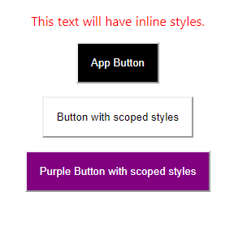

This is an overview on how to apply styles through a basic react app created with the `create-react-app` [command] (https://github.com/facebook/create-react-app#quick-overview).

```bash
npx create-react-app <app-name>
```

## Inline styles

For inline styles, the CSS properties are written in camel-case with their values in quotations. The properties are in the `style` attribute within double curly braces.

```js
<p style={{color: 'red', textAlign: 'center'}}>This text will have inline styles.</p>
```

## Classes

Import a stylesheet into the component file to have its declared classes available to elements. The element lists the classes within the attribute `className` instead of `class`.

```css
/* App.css */

.Button {
  background-color: black;
  color: white;
  padding: 1rem;
  display: block;
  margin: 1rem auto;
}
```
```js
// App.js

import './App.css';

// ...

<button className="Button">App Button</button>
```

## Scoped styles

If you're coming from a Vue.js background, you would be familiar with "scoped-styles" which keep a component's styles separate from affecting other components.

All you need to do is create a `<name>.module.css` file to use scoped styles.

I created a `Button` component which uses the `Button` class created in `Button.module.css`.

Unlike the `Button` class created in `App.css`, this one has the background-color and text color switched.

```css
/* Button.module.css */

.Button {
    background-color: white;
    color: black;
    padding: 1rem;
    display: block;
    margin: 1rem auto;
}
```

You need to name the import (here I used `classes`) to access the classes. Assign a class with `classes.Button` put in the `className` attribute.

```js
// Button.js

import React, { Component } from 'react';

import classes from './Button.module.css';

class Button extends Component {
    render() {
        return (
            <button className={classes.Button}>Button with scoped styles</button>
        );
    }
}

export default Button;
```

`classes` is an object of all the classes in `Button.module.css`. In the console, `classes` looks like this:

```bash
{Button: "Button_Button__SRy8D"}
```

When rendered, the button will have the `Button` value as its class. The unique hash you see makes this class unique to this component so any other `Button` class won't clash styles with it.

You can see this when the `<Button />` component is used in the `App` component.

```js
// App.js

import React from 'react';
import './App.css';

import Button from './component/Button';

function App() {
  return (
    <div className="App">
      <button className="Button">App Button</button>
      <Button />
    </div>
  );
}

export default App;
```
Rendered to the page:
```html
<button class="App_Button__1oc6-">App Button</button>

<button class="Button_Button__SRy8D">Button with scoped styles</button>
```
These unique class names keep the `App` and `Button` component's styles from affecting the other even though they have the same class name `Button`.

## Tip

To append more than 1 class from a stylesheet, join them with the Array's `join()` method:

```css
/* Button.module.css */

.Button {
    background-color: white;
    color: black;
    padding: 1rem;
    display: block;
    margin: 1rem auto;
}

.Purple {
    background-color: purple;
    color: white;
}
```

```js
<button className={[classes.Button, classes.Purple].join(' ')}>Purple Button with scoped styles</button>
```
Rendered to the page:
```html
<button class="Button_Button__SRy8D Button_Purple__2tiEH">Purple Button with scoped styles</button>
```

Here is a screenshot of the inline, classes, and scoped style examples:


[Found a typo or problem? Edit this page.](https://github.com/Dana94/website/blob/master/blog/2020-05-01-styling-in-react.md)
