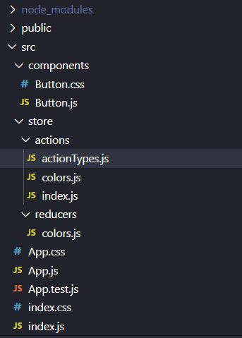
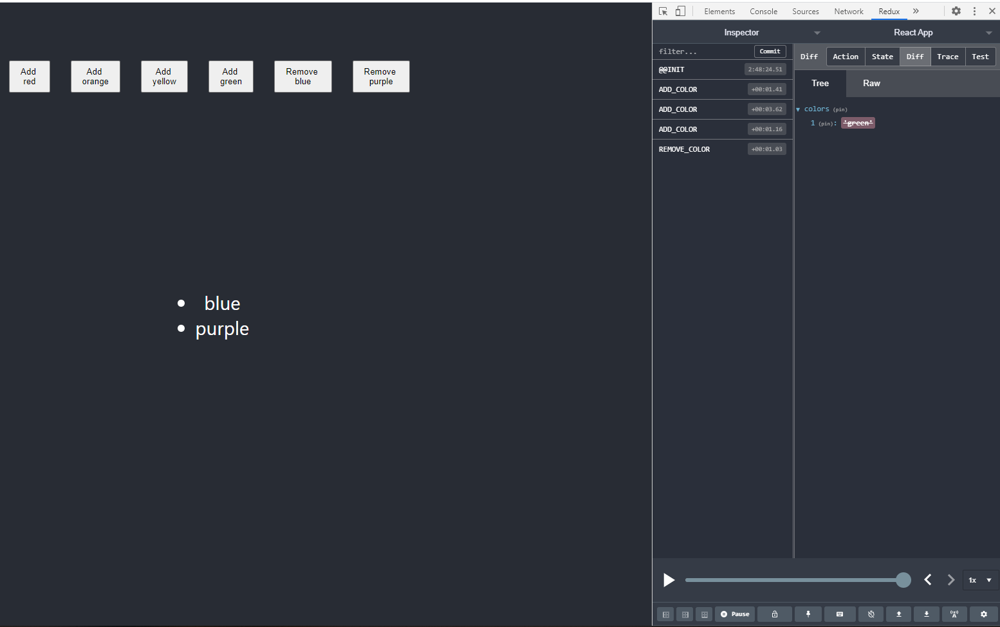

Redux is a commonly used library that is not affiliated with React. It is used to manage state throughout the app. If you know Vue.js you may have used Vuex, the state management library for Vue.js projects. It's the same idea.

Vuex has `Actions`, `Mutations` and `Getters`.

React has `Actions`, `Reducers` and `Subscriptions`.

So in both libraries there are 3 main functions when managing state:
- what to do with the state (actions)
- how to change the state (mutations and reducers)
- how to get an updated version of the state (getters and subscriptions)

## Table of Contents

## Install

Both `redux` and `react-redux` need to be saved as dev dependencies in your project. `react-redux` connects the data from `redux` to the app components.

```bash
npm install --save redux react-redux
```

## Folder Structure

There will be a designated `store` folder to hold all actions and reducers for your project.

Here there will be separate `actions/` and `reducers/` folders to separate actions and reducers files.



## Actions

Actions are functions to declare what needs to modify the state. They return an object containing a `type` and optional arguments.

React is not needed to create action files. Each action needs to be exported if it's used in a component.

The actions below either add or remove a color value from the state.
```js
export const addColor = (color) => {
    return {
        type: 'ADD_COLOR',
        color: color
    }
}

export const removeColor = (color) => {
    return {
        type: 'REMOVE_COLOR',
        color: color
    }
}
```

If you have multiple action files, it's useful to include an index.js to allow a component to export any actions all in one place.

`./src/store/actions/index.js`

```js
export {addColor, removeColor} from './colors';
```

That way, there is no confusion if the correct actions file is being called. Of course, there is only one actions file in this example so it's not really necessary.

```js
import * as actions from '../store/actions/index.js';
```

## Reducers

Reducers hold the state for a value and also modify it depending on what actions are called. It's best practice to name the reducer and action file the name of the value being changed. In this case there would be an `colors.js` in both the `actions/` and `reducers/` folders.

The switch statement checks what the `action.type` is to know how to modify the `colors` array with `action.color` being the value passed.

`./src/store/reducers/colors.js`

```js
const initialState = {
    colors: []
}

const reducer = (state = initialState, action) => {
    switch (action.type) {
        case 'ADD_COLOR':
            const colors = [...state.colors];
            colors.push(action.color);
            return {
                colors: colors
            }
        case 'REMOVE_COLOR':
            return {
                colors: state.colors.filter(color => color !== action.color)
            }
        default:
            return state;
    }
}

export default reducer;
```

## Subscriptions

## Use in a Component

Create a function to handle the state and in receiving an updated version of it.

`mapStateToProps` is the common name for mapping global state values in a component. They will be accessed using `props.<state value>`.

All this step is doing is assigning a local prop value to a state value to make it available.

```js
const mapStateToProps = state => {
    return {
        colors: state.colors
    }
}
```

Used in a component:

```js
<ul>
    {props.colors.map(color => {
    return <li key={color}>{color}</li>;
    })}
</ul>
```

`mapDispatchToProps` is the common name for mapping actions to accessible functions in the component. They will be called using `props.<dispatch>`.

Similar to `mapStateToProps`, props are bring assigned functions to handle dispatching an action from the component.

The arguments `state` and `dispatch` are given by Redux. The `actions` are the imports available at `./src/store/actions/index.js` to be used.

```js
import * as actions from '../store/actions/index.js';

// ...

const mapDispatchToProps = dispatch => {
    return {
        onAddColor: (color) => dispatch(actions.addColor(color)),
        onRemoveColor: (color) => dispatch(actions.removeColor(color)),
    }
}
```

Used in an element:

```js
<button onClick={() => props.onAddColor('blue')}>Add blue</button> :
```

The last thing to do is to use the `connect` package from `react-redux` to connect these functions to the component.

```js
import { connect } from 'react-redux';

// ...

export default connect(mapStateToProps, mapDispatchToProps)(App);
```

Order is important! Make sure to add `null` as a value to the first parameter if `mapStateToProps` is not used. If `mapDispatchToProps` is omitted, then just send one argument in.

These names `mapStateToProps` and `mapDispatchToProps` are commonly used in Redux apps, but they can be whatever you prefer.

Examples:
```js
export default connect(mapStateToProps)(App);
```
```js
export default connect(null, mapDispatchToProps)(App);
```


## Connect Redux to App

Redux needs to connect all reducers by creating a store in the `index.js` file located in the root of the project.

The `createStore` from `redux` takes the `reducer` to create the store.

The `Provider` from `react-redux` provides the wrapping tags to make the store available to the app.

`./src/index.js`

```js
import { createStore } from 'redux';
import { Provider } from 'react-redux';

import reducer from './store/reducers/colors';

const store = createStore(reducer);

ReactDOM.render(
  <Provider store={store}>
    <React.StrictMode>
      <App />
    </React.StrictMode>
  </Provider>,
  document.getElementById('root')
);
```

<b>Note:</b> The Provider tags should wrap <i>everything</i>.

## Chrome Extension

[Redux Devtools](https://github.com/zalmoxisus/redux-devtools-extension) is a useful browser extension specifically for reporting all changes in Redux state.

If you aren't using middleware (in a future post), it's as simple as adding this line in the `createStore` line.

```js
const store = createStore(
  reducer,
  window.__REDUX_DEVTOOLS_EXTENSION__ && window.__REDUX_DEVTOOLS_EXTENSION__()
);
```


_Redux Devtools_

## When Not to use Redux

You don't need to use Redux if you only have to manage data in one component. Using the hook `useState` or creating a class component would be able to handle local state change.

Redux is useful to having the state available anywhere along with the actions to modify the state.

## Notes

If you have more than a few types to use in your actions, a file exporting all these types would be useful to keep track of changes.

`./src/store/actions/actionTypes.js`

```js
export const ADD_COLOR = 'ADD_COLOR';
export const REMOVE_COLOR = 'REMOVE_COLOR';
```

This needs to be imported in any action files to use the types.

```js
import * as actionTypes from './actionTypes';

export const addColor = (color) => {
    return {
        type: actionTypes.ADD_COLOR,
        color: color
    }
}

export const removeColor = (color) => {
    return {
        type: actionTypes.REMOVE_COLOR,
        color: color
    }
}
```

If you're interested in the repo for this example, it is available [here]().

[Found a typo or problem? Edit this page.](https://github.com/Dana94/website/blob/master/blog/2020-06-05-using-vue-apollo-in-vuejs.md)
