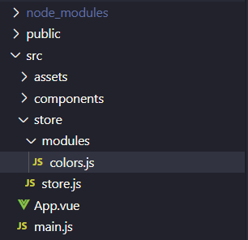
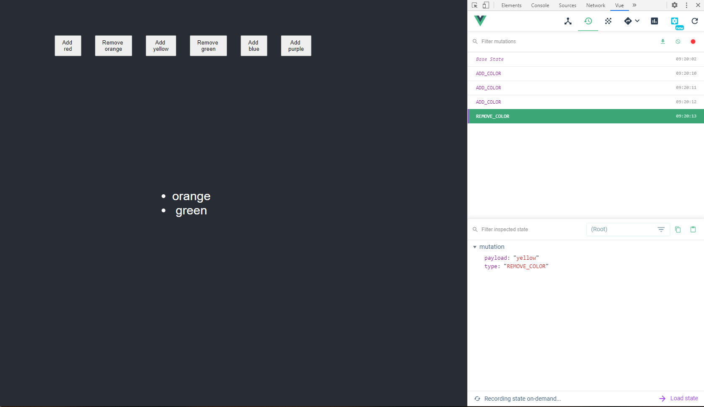

I recently made a [Redux](/using-redux-in-react) post and thought it was time to finally make another Vue.js post and introduce Vuex.

Vuex has `Actions`, `Mutations` and `Getters`.

Actions dictate what to do with the state.

Mutations are what affects the state (they are called by actions).

Getters return the state.

## Table of Contents

## Install

Save `vuex` as a dev dependency in your project.

```bash
npm install vuex --save
```

## Folder Structure

There will be a designated `store` folder to hold all parts of the store containing a `store.js` file.

Depending on your store, you can hold all the code here. I'm not going to do that and instead make a subdirectory that handles all the actions, mutations, and getters to show how you would manage separate states for a bigger application.

In `./src/store/store.js` we're just creating the store.

`Vue` and `Vuex` are both used here with `colors` being imported by that subdirectory mentioned earlier (we'll get to this in the next step).

```js
import Vue from 'vue';
import Vuex from 'vuex';

import colors from './modules/colors';

Vue.use(Vuex);

export default new Vuex.Store({
    modules: {
        colors
    }
});
```

You'll see the `modules` object in the new store we created. If I have more than one module, their functions are separated.

In `store/` add a `modules/` folder with a name to encompass the store data for this file. Here there will be a `colors.js` for this.


_Folder structure with Vuex_

## Create the Store

The `colors.js` will contain:

- state
- mutations
- actions
- getters

For the state, there just needs to be an array holding all the color names.

```js
const state = {
    colors: []
}
```

This state declared will be modified with mutations adding or removing colors from the array.

I was taught to name mutations in all uppercase so that's what you see below.

The arguments will always have `state` first and other optional arguments used to modify it.

For `ADD_COLOR`, the new `color` is pushed onto the `state.colors` array.

For `REMOVE_COLORS`, a new `state.colors` is assigned by filtering the array and returning all colors that don't match the one being removed.

```js
const mutations = {
    ADD_COLOR(state, color) {
        state.colors.push(color);
    },
    REMOVE_COLOR(state, color) {
        state.colors = state.colors.filter(aColor => aColor !== color);
    }
};
```

Next are the actions. These will be dispatched from a component to call the mutation.

Every action has at least the `{commit}` argument used to call a mutation.

Commits are what calls the mutations through an action.

The `payload` you see is the typical name for the optional arguments passed to an action. For here, it's the `color` value as seen as the second argument in the mutations.

`addColor` calls `ADD_COLOR` and passes the payload.

`removeColor` calls `REMOVE_COLOR` and passes the payload.

```js
const actions = {
    addColor({commit}, payload) {
        commit('ADD_COLOR', payload);
    },
    removeColor({commit}, payload) {
        commit('REMOVE_COLOR', payload)
    }
};
```

A commit can also be written as an object with the `type` being the mutation to call.

```js
addColor({commit}, payload) {
    commit({
        type: 'ADD_COLOR',
        color: payload
    });
}
```

Keep in mind that changing this setup will mean the mutation needs to be changed to reflect the payload's value.

`{ "type": "ADD_COLOR", "color": "orange" }`

So the color value will need to be accessed by destructuring to push `color` onto the array.

```js
ADD_COLOR(state, {color}) {
    state.colors.push(color);
}
```

Finally, there is a single getter for a component to receive the latest `state.colors`.

Like with mutations, the state needs to be passed as a parameter to return it.

```js
const getters = {
    getColors(state) {
        return state.colors;
    }
};
```

Then everything declared needs to be exported to be used in the `store.js`.

```js
export default {
    state,
    mutations,
    actions,
    getters
}
```

## Connect the Store to the App

The store needs to be imported and passed as an argument in the created `Vue` instance for the project.

`./src/main.js`

```js
import Vue from 'vue'
import App from './App.vue'

import store from './store/store'

Vue.config.productionTip = false

new Vue({
  store,
  render: h => h(App),
}).$mount('#app')
```

## Use in a Component

Now that the store is all set up, a component can access the state using actions and getters created previously.

There are 2 ways to use actions:

- `dispatch` command
- `mapActions`

With the action's name, use `this.$store.dispatch` in your component to dispatch an action in your store. If you need to pass a value, that's the second argument.

```js
 methods: {
    addColorHandler() {
      this.$store.dispatch('addColor', this.color);
    },
    removeColorHandler() {
      this.$store.dispatch('removeColor', this.color);
    },
  }
```

If using `mapActions`, this first needs to be imported from `vuex`.

Within methods, `mapActions` contains the string values of the created actions in the store.

They can be used by calling `this.<action>`.

```js
import { mapActions } from 'vuex';

methods: {
  ...mapActions([
    'addColor',
    'removeColor'
  ]),
  addColorHandler() {
    this.addColor(this.color);
  },
  removeColorHandler() {
    this.removeColor(this.color);
  }
}
```

There are 2 ways to use getters:

- `dispatch` command
- `mapGetters`

With the name of the getter, use `this.$store.getters` in your component to receive the state data.

Calling the `getColors` getter will have the current state accessible with `this.colors` in the component.

```js
computed: {
    colors() {
        return this.$store.getters.getColors;
    }
}
```

Similar to `mapActions`, there is a `mapGetters` that can be used in the component's computed properties.

This would be called with `this.getColors` in the component.

```js
import { mapGetters } from 'vuex';

computed: {
  ...mapGetters([
    'getColors'
  ])
}
```

## Chrome Extension

[Vue.js Devtools](https://github.com/vuejs/vue-devtools) has a part for managing state in your store. I've only used it by installing it in Chrome.

You can select the clock symbol in the toolbar to see all the actions dispatched when testing your project.


_Vue.js Devtools_

If you're interested in the repo for these examples, it is available [here](https://github.com/Dana94/vuex-intro).

[Found a typo or problem? Edit this page.](https://github.com/Dana94/website/blob/master/blog/2020-06-19-using-vuex-in-vuejs.md)
