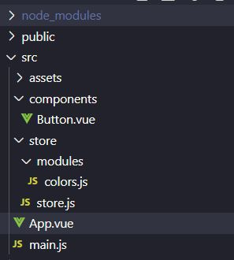
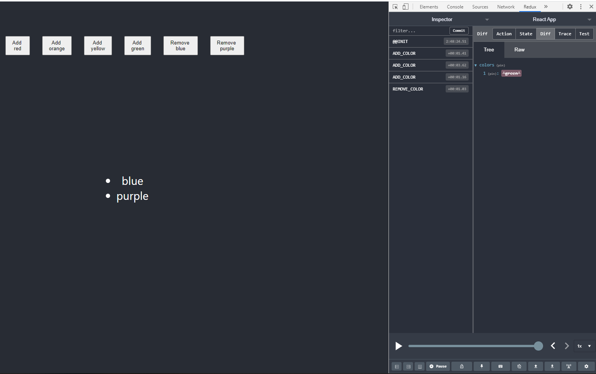

I recently made a [Redux](/using-redux-in-react) post and thought it's make sense to finally make another Vue.js related post and introduce Vuex.

Vuex has `Actions`, `Mutations` and `Getters`.

Actions decide what to do with the state.

Mutations are what affects the state (they are called by actions).

Getters return the state to your components.

## Table of Contents

## Install

Save `vuex` as a dev dependencies in your project.

```bash
npm install vuex --save
```

## Folder Structure

There will be a designated `store` folder to hold all actions and reducers for your project.

There is a `store.js` file here. Depending on your store, you can hold all the code for the store here, but I'm going to not do that and instead make a subdirectory that handles all the actions, mutations, and getters.

In `./src/store/store.js` we're just creating the store.

`Vue` and `Vuex` are both used here with `colors` being imported by that subdirectory mentioned earlier (we'll get to this in the next step).

```js
import Vue from 'vue';
import Vuex from 'vuex';

import colors from './modules/colors';

Vue.use(Vuex);

export default new Vuex.Store({
    modules: {
        colors
    }
});
```

You'll see the `modules` object in the new store we created. This is similar to how [Redux combines reducers](/using-redux-in-react#use-in-a-component) in the project's root `index.js` file. If I have more than one module, their functions are separated.

In `store/` add a `modules/` folder with a name to encompass the store data or this file. Here there will be a `colors.js` for this.


_Folder structure with Vuex_

## Create the Store

The `colors.js` will contain:

- state
- mutations
- actions
- getters

For the state, there just needs to be an array holding all the color names.

```js
const state = {
    colors: []
}
```

This state declared will be modified with mutations. Wither a color will be added or removed from the array.

I was taught to name mutations in all uppercase so that's what you see below.

The arguments will always have `state` since this is how it's accessed with any other optional arguments used to modify it.

For `ADD_COLOR`, the new `color` is pushed onto the `state.colors` array.

For `REMOVE_COLORS`, a new `state.colors` is assigned by filtering the array and returning all colors that don't match the one we're removing.

```js
const mutations = {
    ADD_COLOR(state, color) {
        state.colors.push(color);
    },
    REMOVE_COLOR(state, color) {
        state.colors = state.colors.filter(aColor => aColor !== color);
    }
};
```

Next are the actions. These will be dispatched from a component to call the mutation.

Every action has at least the `{commit}` argument used to call a mutation.

`addColor` calls `ADD_COLOR` passing the payload (which is `color`).

`removeColor` calls `REMOVE_COLOR` passing the payload (which is `color`).

```js
const actions = {
    addColor({commit}, payload) {
        commit('ADD_COLOR', payload);
    },
    removeColor({commit}, payload) {
        commit('REMOVE_COLOR', payload)
    }
};
```

Finally there is a single getter fo ra component to receive the latest `state.colors`.

Like with mutations, the state needs t be passed as a parameter to return it.

```js
const getters = {
    getColors(state) {
        return state.colors;
    }
};
```

Then everything declared needs to be exported to be imported into the `store.js`.

```js
export default {
    state,
    mutations,
    actions,
    getters
}
```

## Connect the Store to App

The store needs to be imported and passed as an argument in the created `Vue` instance.

`./src/main.js`

```js
import Vue from 'vue'
import App from './App.vue'

import store from './store/store';

Vue.config.productionTip = false

new Vue({
  store,
  render: h => h(App),
}).$mount('#app')
```

## Actions

Actions are functions to declare how to the state will be changed. They return an object containing a `type` and optional arguments.

React is not needed to create action files. Each action needs to be exported if it's used in a component.

The actions below either add or remove a color value from the state.

`./src/store/actions/colors.js`

```js
export const addColor = (color) => {
    return {
        type: 'ADD_COLOR',
        color: color
    }
}

export const removeColor = (color) => {
    return {
        type: 'REMOVE_COLOR',
        color: color
    }
}
```

If you have multiple action files, it's useful to include an index.js to allow a component to import any actions all from one place.

`./src/store/actions/index.js`

```js
export {addColor, removeColor} from './colors';
```

That way, there is no confusion if the correct actions file is being called. Of course, there is only one actions file in this example so it's not necessary.

```js
import * as actions from '../store/actions/index.js';
```

## Mutations

Reducers hold the state for a value and modify it depending on what actions are called.

The switch statement checks what the `action.type` is to know how to modify the `colors` array with `action.color` being the value passed.

`./src/store/reducers/colors.js`

```js
const initialState = {
    colors: []
}

const reducer = (state = initialState, action) => {
    switch (action.type) {
        case 'ADD_COLOR':
            const colors = [...state.colors];
            colors.push(action.color);
            return {
                colors: colors
            }
        case 'REMOVE_COLOR':
            return {
                colors: state.colors.filter(color => color !== action.color)
            }
        default:
            return state;
    }
}

export default reducer;
```

## Getters

Subscriptions are executed whenever an action is dispatched and the store is updated.

The subscription is declared immediately under where the store is created. This is used to avoid having to call `getState` manually to get the most up-to-date state.

It contains a function that executes when the state is updated.

`./src/index.js`

```js
const store = createStore(reducer);

store.subscribe(() => {
  console.log('[Subscription]', store.getState());
});
```


## Use in a Component

Actions and getters are used in components to declare current state and modify it.

Actions

2 ways to ue actions.

- `dispatch` command
- `mapActions`

With the action's name, use `this.$store.dispatch` in your component to dispatch an action in your store. If you need to pass a value, that is the second argument.

Calling the `addColor` action:

```js
this.$store.dispatch('addColor', this.color);
```

With `mapActions`, this needs to be imported from `vuex`.

Within methods, `mapActions` contains the string values of the created actions in the store.

With these actions available, they can be called instead through `dispatch`.

```js
import { mapActions } from 'vuex'

methods: {
  ...mapActions([
    'addColor',
    'removeColor'
  ]),
  addColorHandler() {
    this.addColor(this.color);
  },
  removeColorHandler() {
    this.removeColor(this.color);
  }
}
```

Getters

2 ways to ue actions.

- `dispatch` command
- `mapGetters`

With the action's name, use `this.$store.getters` in your component to dispatch an action in your store. If you need to pass a value, that is the second argument.

Calling the `getColors` getter:

```js
this.$store.getters.getColors;
```

Similar to `mapActions`, there is a `mapGetters` that can be used in the component's computed properties (unlike `mapActions` being declared in methods).

```js
import { mapGetters } from 'vuex';

computed: {
  ...mapGetters([
    'getColors'
  ])
}
```

This would be called with `this.getColors` in the component.

## Chrome Extension

[Vue.js Devtools](https://github.com/vuejs/vue-devtools) has a part for managing state in your store. I've only used it by installing it in Chrome.


_Redux Devtools_

If you're interested in the repo for these examples, it is available [here](https://github.com/Dana94/redux-intro).

[Found a typo or problem? Edit this page.](https://github.com/Dana94/website/blob/master/blog/2020-06-07-using-redux-in-react.md)
