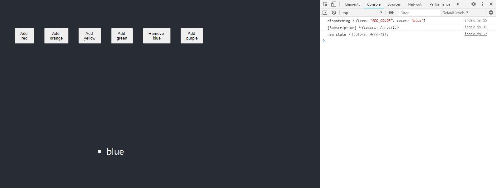

Middleware is a "middle-man" between your store running actions and reducers changing the state. You can have more than 1 middleware in your project.

It can be used when to log whenever an action has occurred or even give crash reports. Middleware is declared in your `./src/index.js` file.

`applyMiddleware` needs to be imported from `redux`.

```js
import { createStore, applyMiddleware } from 'redux';
```

This next snippet based off the [Redux docs](https://redux.js.org/advanced/middleware/#the-final-approach) since it's the most common use for middleware. This needs to be declared before creating the store.

```js
const logger = store => {
  return next => {
    return action => {
      console.log('dispatching', action);
      const result = next(action);
      console.log('new state', store.getState());
      return result;
    }
  }
}
```
There are a few things going on here:

- `store` is the created store being used
- `next(action)` is the same as `store.dispatch(action)` which is dispatching the given `action`
- `store.getState()` returns the current state of the store

`applyMiddleware()` passes `logger` as an argument and is the second argument in the `createStore()` method.

In my [Redux post](/using-redux-in-react), the Redux Devtools was declared as the second argument, this will be changed soon.

```js
const store = createStore(
    reducer,
    applyMiddleware(logger)
);
```
The console messages declared in `logger` will be printed whenever an action is dispatched.


_console example from logger middleware_

There are some pre-made middlewares you can use such as [`redux-thunk`](https://github.com/reduxjs/redux-thunk) which is made for using asynchronous actions in your store.

Install:

```bash
npm install redux-thunk
```

Import `thunk` from `redux-thunk` in `./src/index.js`:

```js
import thunk from 'redux-thunk';
```
Then add it to the `applyMiddleware()` method.

```js
const store = createStore(
  reducer,
  composeEnhancers(applyMiddleware(logger, thunk))
);
```

In `colors.js` where the actions are declared, I renamed `removeColor` to `removeColorAction` and kept the same logic. Instead of a component removing a color immediately, a new created `removeColorDelay` will be used to dispatch this action. Because of `redux-thunk`, I can create a `setTimeout` to make an asynchronous dispatch.

`./src/store/actions/colors.js`

```js
const removeColorAction = (color) => {
    return {
        type: actionTypes.REMOVE_COLOR,
        color: color
    }
}

export const removeColorDelay = (color) => {
    // dispatch is from redux-thunk
    return dispatch => {
        setTimeout(() => {
            dispatch(removeColorAction(color));
        }, 3000)
    }
}
```
With a component calling `removeColorDelay`, there will be a 3 sec delay before the color is removed from the state.

If using the [Redux Devtools](https://github.com/zalmoxisus/redux-devtools-extension), you need to change the set up when using middleware.

Import `compose` from `redux`.

```js
import { createStore, applyMiddleware, compose } from 'redux';
```

Declare a `composeEnhancers` constant which is what will be wrapping the `applyMiddleware()` function.

```js
const composeEnhancers = window.__REDUX_DEVTOOLS_EXTENSION_COMPOSE__ || compose;

const store = createStore(
  reducer,
  composeEnhancers(applyMiddleware(logger, thunk))
);
```

This example can be found in the [`redux-intro` repo](https://github.com/Dana94/redux-intro).

Resources:

- [Redux Docs - Middleware](https://redux.js.org/advanced/middleware)

- [Redux Devtools - Advanced store setup](https://github.com/zalmoxisus/redux-devtools-extension#12-advanced-store-setup)


If you're interested in the repo for these examples, it is available [here](https://github.com/Dana94/vuex-intro).

[Found a typo or problem? Edit this page.](https://github.com/Dana94/website/blob/master/blog/2020-06-26-middleware-in-redux.md)
