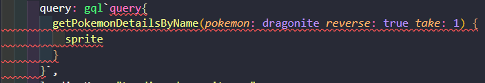

My first project where I had to use data from a GraphQL API was in my [quotes database](https://github.com/Dana94/quotes-database). The quotes were all set up and I needed a tool to query them into my Vue.js project.

[Vue Apollo](https://apollo.vuejs.org/) is a library that makes it easy to integrate [Apollo](https://www.apollographql.com/) and connect to your API.

You can do so much more than query for data with Vue Apollo and I recommend you check it out. This post is only for querying since this is why I needed it and I found a few "gotchas" along the way that I wanted to clarify.

In this post I'll be using this [Pokemon API](https://graphqlpokemon.favware.tech/).

## Table of Contents

## Install

```bash
npm install --save vue-apollo graphql apollo-boost
```

## Setup

The `main.js` file needs to be configured to use Vue Apollo.

Import `ApolloClient` from `apollo-boost` and create a new instance containing the url for the API.

```js
import ApolloClient from 'apollo-boost';

const apolloClient = new ApolloClient({
  uri: 'https://graphqlpokemon.favware.tech/'
})
```

Then import the `VueApollo` plugin from `vue-apollo` and install it into Vue.

```js
import VueApollo from 'vue-apollo';

Vue.use(VueApollo)
```

Finally, create a `VueApollo` instance with its `defaultClient` as the `apolloClient` created before and add it to the app.

```js
const apolloProvider = new VueApollo({
  defaultClient: apolloClient,
})

new Vue({
  apolloProvider,
  render: h => h(App),
}).$mount('#app')
```

Next step is optional. If using VS Code, you can install the [Apollo GraphQL](https://marketplace.visualstudio.com/items?itemName=apollographql.vscode-apollo) extension. Then have a `apollo.config.js` file in the root of the project to configure it.

I kept everything the same as in the [docs](https://vue-apollo.netlify.app/guide/installation.html#visual-studio-code), except changing the url to the API I'm using.

```js
module.exports = {
    client: {
        service: {
            name: 'my-app',
            // URL to the GraphQL API
            url: 'https://graphqlpokemon.favware.tech/',
        },
        // Files processed by the extension
        includes: [
            'src/**/*.vue',
            'src/**/*.js',
        ],
    },
}
```

## Apollo Object

In a component, the queries need to be declared using the `gql` from `graphql-tag`.

```js
import gql from 'graphql-tag';
```

There will be an `apollo` object for mapping the query to local data.

A basic query will just have `apollo` containing an attribute for the query, such as this simple query example from the [Vue Apollo docs](https://vue-apollo.netlify.app/guide/apollo/queries.html#simple-query) with `hello` being the local data:

```js
import gql from 'graphql-tag';

export default {
  apollo: {
    hello: gql`{hello}`,
  }
}
```

Notice the backticks (\`\`) used around the query.

You could also create a constant for the query and assign it like this:

```js
import gql from 'graphql-tag';

const helloQuery = gql`{hello}`;

export default {
  apollo: {
    hello: {
      query: helloQuery,
    }
  }
}
```

The data from this query can be accessed in the html like this:

```html
<template>
  <div class="apollo">
    <h3>Hello</h3>
    <p>
      {{hello}}
    </p>
  </div>
</template>
```

The Pokemon API doesn't have any queries that don't require parameters, so the rest of the examples make use of what else Vue Apollo offers.

## Examples:

### Set Parameters

The `gql` defines the query by encompassing the query in `query{}`.

In this example, the values `dragonite` for parameter `pokemon`, `true` for parameter `reverse` and `1` for parameter `take` are hard-coded.

```js
import gql from 'graphql-tag';

export default {
  name: 'App',
  apollo: {
    dragonite: {
      query: gql`query{
        getPokemonDetailsByName(pokemon: dragonite reverse: true take: 1) {
          sprite
        }
      }`,
      loadingKey: "Loading dragonite...",
      update: data => data.getPokemonDetailsByName
    }
  }
}
```

I queried for the `sprite` which is a gif that can be used in an `img` tag:

```html

```

The `loadingKey` and `update` will be explained in the Query Options section.

### Reactive Parameters

The `variables` option is useful when you don't want to hard-code the values. An example of this could be if you had the query running based on a user search input.

One addition to the previous example is that the types for each query parameter has to be defined. I created a name called `getPokemon` to define this part. The name can be whatever you want - it doesn't affect the query. Only the parameter names and their types need to reflect the API's docs.

The query `getDexEntries` receives the parameter `pokemon` of type `String!` (a string that is required, hence the exclamation point).

The variable defined `pokemon` in the `variables()` object is connected to `$pokemon` in the `getDexEntries` query.

```js
import gql from 'graphql-tag';

export default {
  name: 'App',
  apollo: {
    bulbasaur: {
      query: gql`query getPokemon($pokemon: String!){
        getDexEntries(pokemon: $pokemon) {
          species
          evos
        }
      }`,
      loadingKey: "Loading bulbasaur...",
      update: data => data.getDexEntries,
      variables() {
        return {
          pokemon: "bulbasaur"
        }
      }
    }
  }
}
```

### Reactive Query

You can set up conditionals to determine what query is called. Here I have an input for entering a pokemon name and another for entering the pokedex id. Depending if the name is entered, the `getPokemonDetailsByFuzzy` query is called, else the `getDexEntryByDexNumber` query is called if the id was given.

If neither input has a value, the query is skipped with the `skip()` helper.

```js
import gql from 'graphql-tag';

export default {
  name: 'Search',
  data() {
    return {
      name: "",
      id: ""
    }
  },
  apollo: {
    searchedPokemon: {
      query() {
        //name
        if(this.name !== "") {
          return gql`query getWithName($pokemon: String!) {
            getPokemonDetailsByFuzzy(pokemon: $pokemon) {
              species
              color
            }
          }`
        }
        // id
        else if (this.id !== "") {
          return gql`query getWithDexNumber($num: Float!){
            getDexEntryByDexNumber(num: $num)
          }`
        }
      },
      loadingKey: "Loading...",
      update: data => data.getPokemonDetailsByFuzzy || data.getDexEntryByDexNumber,
      variables() {
        return {
          pokemon: this.name,
          num: this.id
        }
      },
      skip() {
        return this.name === "" && this.id === ""
      }
    }
  }
}
```

The `update` helper doesn't know which query is being called so it needs to be set up to either map the first query or the second one. If you have more than 2 queries in a conditional, you would keep appending them with the `||` operator.

```js
update: data => data.getPokemonDetailsByFuzzy || data.getDexEntryByDexNumber,
```

This is the html holding the search inputs and displaying the data once it's available.

```html
<template>
  <div class="hello">
    <input v-model.trim="name" placeholder="name" />
    <input v-model.trim.number="id" placeholder="id" />

    <div v-if="searchedPokemon">
      <ul>
        <li>Species: {{searchedPokemon.species}}</li>
        <li>Color: {{searchedPokemon.color}}</li>
      </ul>
    </div>
  </div>
</template>
```

## Query Options

### Loading

The `loadingKey` can be a message that shows while the data is loading. It's accessed by `$apollo.queries.<query>.loadingKey`.

To know if the query is still loading, you can use `$apollo.queries.<query>.loading` in a conditional. The paragraph containing the loading message "Loading dragonite..." will show until the sprite is ready to be displayed.

```html
<p v-if="$apollo.queries.dragonite.loading">{{$apollo.queries.dragonite.loadingKey}}</p>

```

### Update

The `update` option is important if the apollo query object is named differently from the query name itself. I normally change the names if they are too long or don't describe what data is being queried.

In the bulbasaur example, the data from `getDexEntries` is mapped to the value `bulbasaur`, the apollo object for this query.

```js
update: data => data.getDexEntries
```

```js
bulbasaur: {
  query: gql`query getPokemon($pokemon: String!){
    getDexEntries(pokemon: $pokemon) {
      species
      evos
    }
  }`,
  loadingKey: "Loading bulbasaur...",
  update: data => data.getDexEntries,
  variables() {
    return {
      pokemon: "bulbasaur"
    }
  }
}
```

### Skip

The query is skipped depending on the logic returned. There is an example of this being used in the Reactive Query section where the query is skipped if both inputs are clear.

```js
skip() {
  return this.name === "" && this.id === ""
}
```

## Note

I noticed that despite the query working and the data being displayed, the editor may say there's an error in how the query is written.


_Editor Error_

It's odd, but I thought to mention it. 🤷‍♀

## Conclusion

This post summarized everything I've come to understand so far when using the library. I hope this helps anyone else understand how to query with GraphQL in their Vue.js projects.

This example can be found in the [`vue-apollo-example` repo](https://github.com/Dana94/vue-apollo-example).

Resources:

- [Pokemon GraphQL API Repo](https://github.com/favware/graphql-pokemon)

- [Vue Apollo - Name Matching](https://apollo.vuejs.org/guide/apollo/queries.html#name-matching)

- [Vue Apollo - Smart Query](https://apollo.vuejs.org/api/smart-query.html)

- [Vue Apollo - Dollar Apollo](https://apollo.vuejs.org/api/dollar-apollo.html#properties)

- [Apollo GraphQL](https://www.apollographql.com/)


[Found a typo or problem? Edit this page.](https://github.com/Dana94/website/blob/master/blog/2020-07-03-using-vue-apollo-to-query-data.md)
