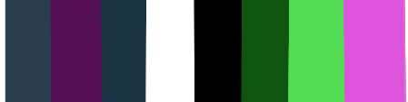
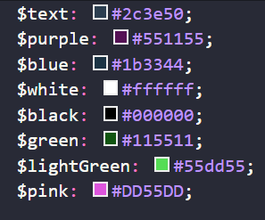
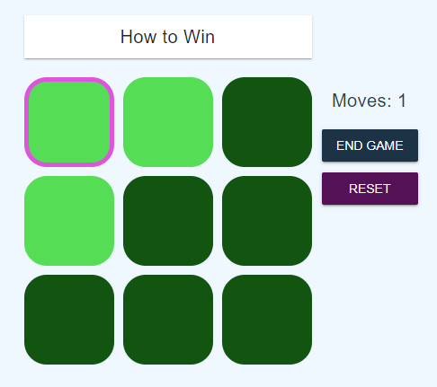

## Inspiration

Inspired from Khanacademy's puzzles, I wanted to create my own project using the logic it would take to make this puzzle work.

Puzzles is something I'm really into and I try to incorporate more in my projects. This was my first full-complete Vue.js project.


_Khanacademy Lights Puzzle_


_My Lights Puzzle_

---

## Store

[Vuex](https://vuex.vuejs.org/) is used as a global store to hold information for:

- **board status**: The board is initialized based on what level is selected.
- **moves count**: Each time a grid is selected, the count increases until the game is reset or ends. Then it's set to 0.
- **level selected**: Assigned before the game starts to assign the correct board size.
- **game progress**: Set to true if the board is complete or ends prematurely through reset or end game options.

Store board resets in board.js

---

## Colors

I used [Vuetify](https://vuetifyjs.com/en/) to display a "Google-like" design to the buttons and use a layout offered in the framework to structure the project.

Style specifics like using grid display for the board.

I set the general color scheme in the base stylesheet `base.scss`.


_Color Scheme_


_Color Scheme Variables_

---

## Components

`Home` component setting level to start game.

The `Board` component passes each array of the board into the `Row` component. In each `Row`, the elements in the arrays are assigned as `Column` components.

The `Row` has minimal functionality whereas the `Column` component has a lot going on.

```html
<template>
  <div
    class="column"
    :ref="colRef"
    :class="{ on: active, off: !active }"
    @keydown.enter="changeStatus"
    @click="changeStatus"
    :tabindex="index_x === 0 && index_y === 0 ? 0 : -1"
    @keydown.up="setFocus(index_x - 1, index_y)"
    @keydown.down="setFocus(index_x + 1, index_y)"
    @keydown.left="setFocus(index_x, index_y - 1)"
    @keydown.right="setFocus(index_x, index_y + 1)"
    @focus="setFocus(index_x, index_y)"
  ></div>
</template>
```

To make this usable through the keyboard, I had to consider how the button will be selected (enter key). That was the easy part, just call the `changeStatus` function to a `keydown.enter` event listener.

Only the first top left grid is able to be tabbed to (so `tabindex=0` and `tabindex=-1` otherwise) so only arrow keys can roam the board.
Using the `keydown` listener for all arrow key directions, they call the `setFocus` method to the next grid the user is tying to select.

`setFocus` sends the coordinates to the store so it's reached by every grid on the board to know which one should have the pink outline.


_Select outline in puzzle_

```js
setFocus (focusX, focusY) {
  this.$store.dispatch('setFocus', {
    x: focusX,
    y: focusY
  });
  eventBus.$emit('changeFocus');
}
```

There is a unique `ref` set to each grid like the first grid is `col_0_0`. This is how to reach the grid that should be set to focus by checking if it matches the coordinates that are in the store.

```js
computed: {
  focus() {
    return this.$store.getters.getFocus;
  },
  colRef () {
    return `col_${this.index_x}_${this.index_y}`;
  }
},
mounted () {
  // change focus depending on state's focus coordinates
  eventBus.$on("changeFocus", event => {
    const focusElem = `col_${this.focus.x}_${this.focus.y}`;
    if (!!this.$refs[focusElem] && this.focus.x === this.index_x && this.focus.y === this.index_y) {
      this.$refs[focusElem].focus();
    }
  });
}
```

`Stats` component sits next to the board and gives the current moves taken as well as the option to reset or end the game to select a new level.

`Rules` uses a dropdown from Vuetify to show the description on how to solve the puzzle.

`EndGame` shows if the game is won displaying how many moves it took to solve it along the options to start the same game or select a new level.

### Conclusion


