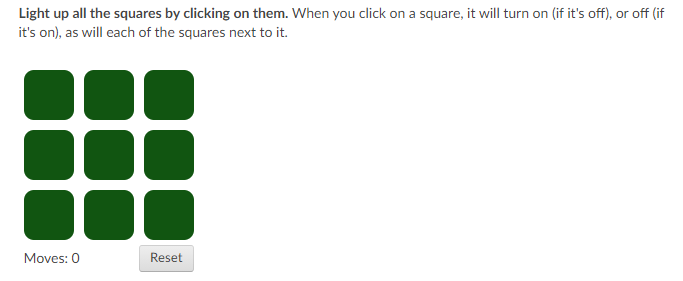
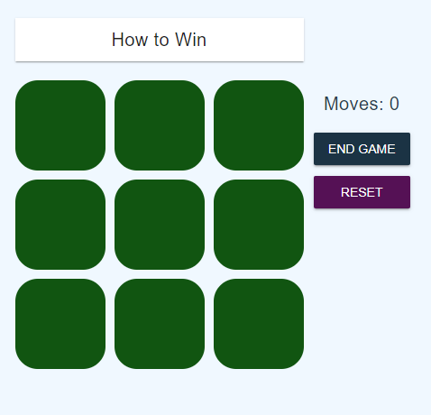
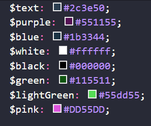

Inspired from Khanacademy's puzzles, I wanted to create my own project using the logic it would take to make this puzzle work.

Puzzles is something I'm really into and I try to incorporate more in my projects. This was my first full-complete Vue.js project.


_Khanacademy Lights Puzzle_



_My Lights Puzzle_

---

[Vuex](https://vuex.vuejs.org/) is used as a global store to hold information for:

-board status
-moves count
-level selected
-game won status

Store board resets in board.js

---

I used [Vuetify](https://vuetifyjs.com/en/) to style the buttons to display a "Google-like" design to the buttons and use a layout to structure the project.

Style specifics like using grid display for the board.


I set the general color scheme in the base stylesheet `base.scss`.


_Color Scheme_

---

Components:

`Home` component setting level to start game.

The `Board` component passes each array of the board into the `Row` component. In each `Row`, the elements in the arrays are assigned as `Column` components.

Thw `Row` has minimal functionality whereas the `Column` component has a lot going on.

```html
<template>
  <div
    class="column"
    :ref="colRef"
    :class="{ on: active, off: !active }"
    @keydown.enter="changeStatus"
    @click="changeStatus"
    :tabindex="index_x === 0 && index_y === 0 ? 0 : -1"
    @keydown.up="setFocus(index_x - 1, index_y)"
    @keydown.down="setFocus(index_x + 1, index_y)"
    @keydown.left="setFocus(index_x, index_y - 1)"
    @keydown.right="setFocus(index_x, index_y + 1)"
    @focus="setFocus(index_x, index_y)"
  ></div>
</template>
```

Change status when turning a grid on/off.

Set focus.

Set colRef

```js
<script>
import { mapGetters, mapActions } from "vuex";
import { eventBus } from "../main";
import store from "../store/store";

export default {
  props: ["index_y", "index_x"],
  methods: {
    changeStatus() {
      this.$store.dispatch("increaseCount");

      this.$store.dispatch("activate", {
        row: this.index_x,
        col: this.index_y
      });
      eventBus.$emit('checkBoard');
    },
    setFocus (focusX, focusY) {
      this.$store.dispatch('setFocus', {
        x: focusX,
        y: focusY
      });
      eventBus.$emit('changeFocus');
    }
  },
  computed: {
    moves () {
      return this.$store.getters.getMoves;
    },
    active() {
      if (this.moves) {
        return this.$store.getters.isOn({
          row: this.index_x,
          col: this.index_y
        });
      }
    },
    focus() {
      return this.$store.getters.getFocus;
    },
    colRef () {
      return `col_${this.index_x}_${this.index_y}`;
    }
  },
  mounted () {
    // change focus depending on state's focus coordinates
    eventBus.$on("changeFocus", event => {
      const focusElem = `col_${this.focus.x}_${this.focus.y}`;
      if (!!this.$refs[focusElem] && this.focus.x === this.index_x && this.focus.y === this.index_y) {
        this.$refs[focusElem].focus();
      }
    });
  }
};
</script>
```

`Stats` component sits next to the board and gives the current moves taken as well as the option to reset or end the game to select a new level.

`Rules` uses a dropdown from Vuetify to show the description on how to solve the puzzle.


EndGame
