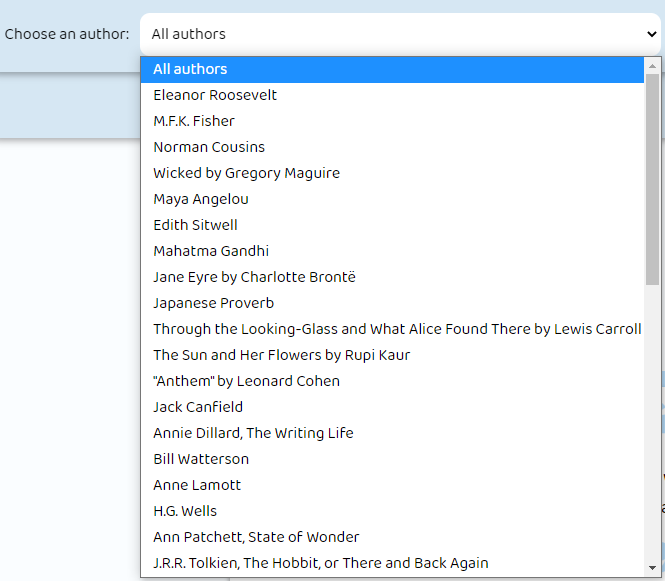
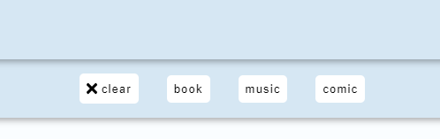
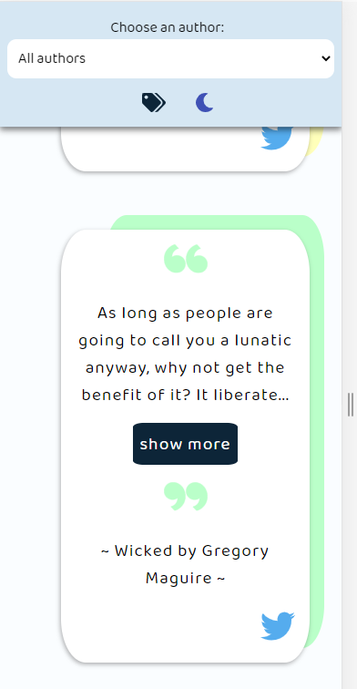
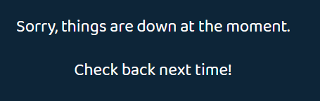
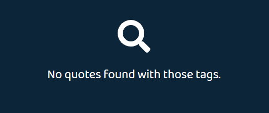

I was collecting a bunch of quotes in a Google spreadsheet and wanted to display them in a project. I was also learning GraphQL, so I wanted to make my own API to query them into a Vue.js project.

---

<h2> Store </h2>

[Vuex](https://vuex.vuejs.org/) is used as a global store to hold information for:

- **theme**: Either set to the `String` value "light" or "dark". The store is where the theme is set in local storage too.
- **authorId**: An integer from the `Dropdown` component set whenever a specific author is selected to query the results in the `App`.
- **tags**: A list of all `String` values of the tags selected to query the results in the `App`.

---

<h2> Design & Colors </h2>

I knew I wanted to implement a light and dark mode to switch between.

I came up with the "pastel rainbow" colors for the "light" mode.


_Pastel Colors Scheme_

Along with a neon color scheme for the "dark" mode.


_Dark Colors Scheme_

While there were quite a few icons I used from [Fontawesome](https://fontawesome.com/), the quotation symbols were created by me using [Inkscape](https://inkscape.org/). I had to create a pair of open and closed quotations for every single color in both schemes.


_View of Inkscape_

---

<h2> Components </h2>

`App`

Queries the `quotes` list from the API. It will search using `quotesByAuthorId` if a specific author is chosen from the dropdown, `quotesByTagNames` depending on what tags are chosen, or just the general `quotes` query if nothing is selected to filter the results.

```js
export default {
  name: 'App',
  data() {
    return {
      quotes: []
    }
  },
  apollo: {
    quotes: {
      query () {
        if (this.authorSelected !== null) {
          return gql`query authorQuotes($id: Int!, $tags: [String]!) {
            quotesByAuthorId(authorId: $id, tags: $tags) {
              quote
              author {
                name
                description
              }
            }
          }`
        } else if(this.tags.length > 0) {
          return gql`query tagQuotes($tags: [String]!) {
            quotesByTagNames(tags: $tags) {
              quote
              author {
                name
                description
              }
            }
          }`
        }
        else {
          return gql(`{
            quotes {
              quote
              author {
                name
                description
              }
            }
          }`)
        }
      },
      loadingKey: "Wisdom coming up...",
      update: data => data.quotesByAuthorId || data.quotesByTagNames || data.quotes,
      variables () {
        return {
          id: this.authorSelected,
          tags: this.tags
        }
      },
    },
  },
  computed: {
    theme() {
      return this.$store.getters.getTheme;
    },
    search() {
      return this.$store.getters.getSearch;
    },
    authorSelected() {
      return this.$store.getters.getAuthor;
    },
    tags() {
      return this.$store.getters.getTags;
    }
  },
  created() {
    this.$store.dispatch('initTheme');
  },
  components: {
    Toolbar,
    Cards,
    Loading,
    Error,
    NoResults
  }
}
```

`Dropdown`

Queries the `authors` list from the API. When a value is selected, it is passed to the store for the `App` to use.


_Authors Dropdown_

`SwitchTheme`

Toggles the light/dark theme throughout the site. This also sets the theme in local storage so reloading the page keeps the selected theme visible.


_Theme Switch_

`TagMenu`

Tag menu is hidden unless the tags icon is selected to display the menu. The list of tags are retrieved using the `tags` query.


_Open Tags Menu_

`Tag`

When a tag is clicked, it's added to the list of tags in the store to influence what quotes are retrieved. Depending if the menu is visible or not, the `TagsMenu` sends down a `prop` called `focusable` which sets the tags as able to be tabbed to (so `tabindex=0` if shown and `tabindex=-1` if hidden) depending if it should be reached by the keyboard or not.

`Card`

When it comes to assigning colors, it depends on the index of each quote in the array of quotes. Some of the colors have the same name when it comes to the different themes (blue, green, and red) while yellow becomes purple in the dark theme as the orange becomes pink. This is all within a computed property that is assigned to the under-card and quotation svgs to assign their color.

```js
cardColor() {
    let color = 'red';
    if (this.id % 5 === 0){
        color = 'blue';
    } else if (this.id % 4 === 0) {
        color = 'green';
    }
    else if (this.id % 3 === 0) {
        color = this.theme === 'light' ? 'yellow' : 'purple';
    }
    else if (this.id % 2 === 0) {
        color = this.theme === 'light' ? 'orange' : 'pink';
    }
    else {
        color = 'red'
    }
    return color;
}
```

Depending on the size of the screen, there is a "show more" button for longer quotes (character length larger than 260). For these instances, a `shortenQuote` is displayed that cuts off the quote and appends ellipses.


_Shortened Quote_

There is also an option to post the quote to Twitter via a sharing link.

`Error`

A message if something is wrong querying the data.


_Error Message_

`Loading`

A levitating message to show while the quotes are being queried. This message is from the optional `loadingKey` attribute in a `vue-apollo` query.


_Loading Message_

`NoResults`

A message if the author combined with the tags selected don't give any results.


_No Results Message_

---

<h2> Conclusion </h2>

Since I learned about GraphQL, I wanted to implement an example of using it in a project. This was also my first experience using Vue-Apollo ([which I made a post about](/using-vue-apollo-to-query-data)).

I first considered having a search bar so the user can type in something to filter out quotes, but I thought this idea was too vague considering I wouldn't know what to enter and thought giving them a list of authors they'd recognize was a better idea.

[You can find the project on my GitHub](https://github.com/Dana94/quotes-database).

[Found a typo or problem? Edit this page.](https://github.com/Dana94/website/blob/master/blog/2020-10-09-quotes-project-outline.md)
