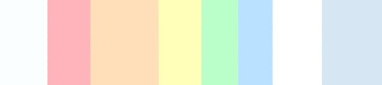
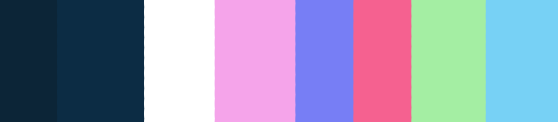

I was collecting a bunch of quotes in a Google spreadsheet and wanted to display them in a project. I was also learning GraphQL, so I wanted to make my own API to query them into a Vue.js project.

---

## Store

---

## Design & Colors

I knew I wanted to implement a light and dark mode to switch between.

I came up with the "pastel rainbow" colors for the "light" mode.

_Pastel Colors Scheme_

Along with a neon color scheme for the "dark" mode.

_Dark Colors Scheme_

While there were quite a few icons I used from [Fontawesome](https://fontawesome.com/), the quotation symbols were created by me using [Inkscape](https://inkscape.org/). I had to create a pair of open and closed quotes for every single color in both schemes.

<!-- show example -->

---

## Components

`App`

`SearchBar`

`Dropdown`

`SwitchTheme`

`TagMenu`

`Tag`

`Cards`

`Card`

`Error`

`Loading`

`NoResults`

---

### Conclusion

[You can find the project on my GitHub](https://github.com/Dana94/quotes-database).

<!-- [Found a typo or problem? Edit this page.](https://github.com/Dana94/website/blob/master/blog/2020-09-25-lights-puzzle-outline.md) -->
