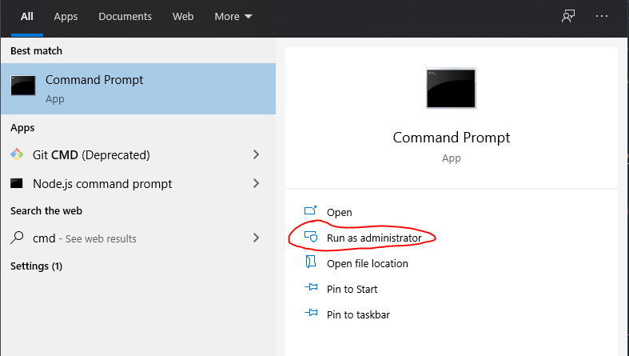

A while ago I was renaming a folder and accidentally created an invalid name that caused the directory to be unknown to the computer thus unable to change the name or delete it. 🤦

While searching for solutions, I came across a way to delete the directory using the command-line. The `rd` command is used to delete a directory using the `/s` parameter to delete all of its subdirectories.

You need to run the command prompt as an administrator. I just choose this option in the start menu.


_Run command prompt as admin_

Include the folder path in double quotations after the `rd /s` commands. You will be asked to confirm to delete it, just hit "y" then "enter".

```bash
> rd /s "path/to/folder/to/delete"
"path/to/folder/to/delete", Are you sure (Y/N)? y
```

You won't see the folder in the recycle bin, it will just be gone.

As frustrating as it is that I couldn't just delete a folder the usual way, I was glad to have to look up another approach through the command-line to solve this problem.

Resources:

- [Microsoft Docs - Windows Commands - rd](https://docs.microsoft.com/en-us/windows-server/administration/windows-commands/rd)

[Found a typo or problem? Edit this page.](https://github.com/Dana94/website/blob/master/blog/2020-11-06-deleting-an-unknown-folder.md)
