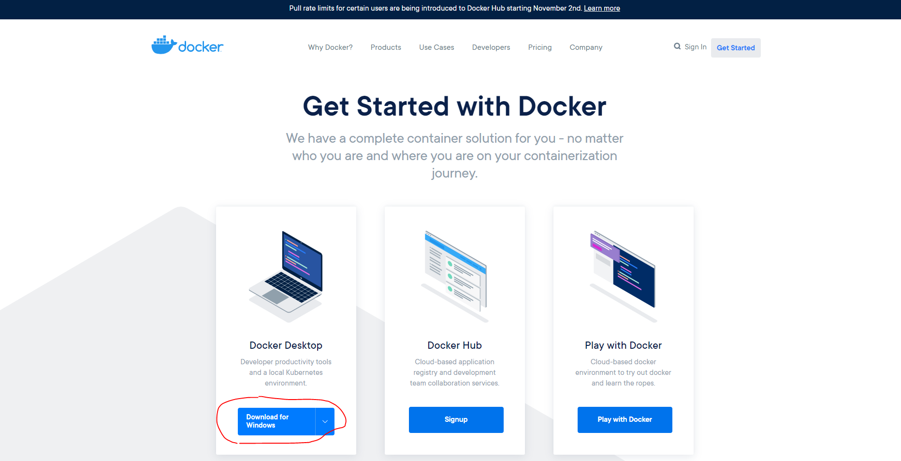

I was first introduced to Docker in one of my previous jobs and all I knew about it was that it allowed you to run programs on your machine without having to locally install dependencies required for it. I will be making multiple posts documenting what I learn about Docker.

## What is Docker?

Docker is used for creating and managing containers.

A **container** is a package of the code and dependencies needed to run the program. No matter where it's running, it should always execute the same way.


_Docker visual_

You may be wondering "why not use virtual machines?". Well, having multiple machines on your computer can give the same use of allowing others to load up the same project, but this can cause slow performance and use up a lot of space on your computer. Docker doesn't require an OS in a container. You just need a configuration file to share (like a blueprint) so others can remake the container.

## Docker Setup (Windows Version)

Since I have Windows 10 Pro, I wanted to give an overview of my experience installing Docker on Windows. There are also directions on how to install on Mac and Linux [available here](https://docs.docker.com/engine/install/). Make sure you check the system requirements for each OS.

Here's what I did:

1) Enable Hyper-V and containers features (needed to create virtual machines).

Run PowerShell as administrator and enable Hyper-V:

```bash
> Enable-WindowsOptionalFeature -Online -FeatureName Microsoft-Hyper-V -All
```
_[Source](https://docs.microsoft.com/en-us/virtualization/hyper-v-on-windows/quick-start/enable-hyper-v)_

2) Enable containers.

```bash
> Enable-WindowsOptionalFeature -Online -FeatureName containers –All
```

3) Go to [Docker's Get Started](https://www.docker.com/get-started) page to download the Window's version of Docker Desktop.


_Docker's Get Started Page_

When I clicked the installer, I kept all of the options checked (except the desktop shortcut which I didn't select).

I then had to restart my computer, when I logged back in, I got an error about WSL 2. I ran Docker Desktop from the start menu and changed the dependency on WSL 2 in settings so Docker could run properly. Then chose "Apply & Restart" at the bottom after I unchecked it.


_Docker Settings_

I ran `docker` in a command prompt (without admin access). You should see a list of commands to show that it is running.

## Notes

- **Docker Desktop** installs **Docker Engine** and has a Daemon and CLI.
- I installed **Docker Desktop** on my computer since I had the requirements. If I didn't, I would've had to install **Docker Toolbox** instead.
- Whichever I used, **Docker Engine** would still have been installed.

## Resources

- There is a [Docker Playground](https://labs.play-with-docker.com/) for practicing Docker in the browser.
- There are also tons of [tutorials on the Docker site](https://www.docker.com/play-with-docker) to help you learn.
- If using VS Code you can use the extension [Docker by Microsoft](https://marketplace.visualstudio.com/items?itemName=ms-azuretools.vscode-docker) to help.

[Found a typo or problem? Edit this page.](https://github.com/Dana94/website/blob/master/blog/2021-01-15-docker-part-1-intro-and-installation.md)
