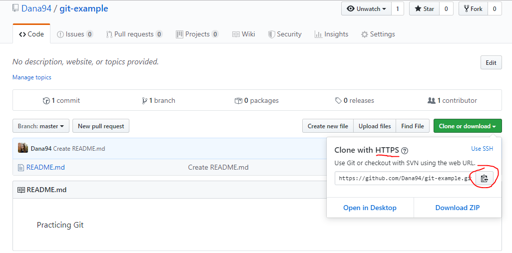
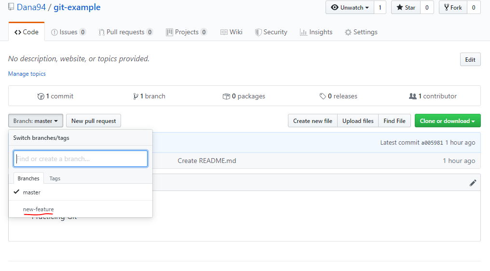

## Table of Contents


## Prerequisite

Install Git from this [page](https://git-scm.com/downloads).

You cannot immediately use Git in a project until the project is initialized for it.
There are 2 ways I go about this:

## Initialize

`Git init`

For a project you only have locally on your computer and not in GitHub.

Initialize the project as a Git repository (repo). The command will automatically create the `master` branch.

```shell
~/
$ mkdir sample-repo

~/
$ cd sample-repo/

~/sample-repo
$ git init
```

Or pull down a new repo from GitHub.

`Git clone <url>`

Download a repo from GitHub onto your computer. The project will already be a Git repository.

Make sure HTTPS is selected, and click the copy to clipboard button.



Add the url after `git clone`.

```shell
~/
$ git clone https://github.com/Dana94/git-example.git
```

## Creating branches

It’s important to not work in your base branch (usually this is `master`). Make sure to be constantly working in separate branches for different features.

`Git checkout <branch-name>`

Changes the branch you are currently working in to the one you specify. This will only work if the branch you want to change to already exists.

To create a new branch and check it out:

`Git checkout –b <new-branch-name>`

```shell
~/git-example (master)
$ git checkout -b new-feature
Switched to a new branch 'new-feature'

~/git-example (new-feature)
$ git checkout master
Switched to branch 'master'
```

`Git branch`

Displays a list of the branches in your repo. The branch with an asterisk next to it is the one you are currently working in.

```shell
~/git-example (master)
$ git branch
* master
  new-feature
```

## Committing File Changes

`git status`

Displays a list of files marked in red or green to show whether the file is unstaged or staged, respectively.

```shell
~/git-example (new-feature)
$ touch sample.txt

~/git-example (new-feature)
$ git status
On branch new-feature
Untracked files:
  (use "git add <file>..." to include in what will be committed)

        sample.txt

nothing added to commit but untracked files present (use "git add" to track)
```

`git add`

Stage edited files.

`-A`

I commonly use this flag which stages all file changes.

`.`

Stages all new files and modifications without deletions ([thanks to this post for clarifying that](https://stackoverflow.com/questions/572549/difference-between-git-add-a-and-git-add?rq=1)).

```shell
~/git-example (new-feature)
$ git add .

~/git-example (new-feature)
$ git status
On branch new-feature
Changes to be committed:
  (use "git reset HEAD <file>..." to unstage)

        new file:   sample.txt
```

```git commit```

Commit your changes. Can only be done once you’ve staged any file(s).

```-m```

I never use this command without this flag. Add a short description to describe the changes you've made.

```shell
~/git-example (new-feature)
$ git commit -m "add new file"
[new-feature bbf2f75] add new file
 1 file changed, 0 insertions(+), 0 deletions(-)
 create mode 100644 sample.txt
```

`git log`

List most recent commit messages.

```shell
~/git-example (new-feature)
$ git log
commit bbf2f75624e2b29f8a8e11186f4ad5833f7776ee
Author: Dana Ottaviani
Date:   Wed Aug 14 09:41:57 2019 -0400

    add new file

commit a005981daa9cd2a1645f8a78fd0fcc12c6e461c5
Author: Dana Ottaviani
Date:   Wed Aug 14 08:51:52 2019 -0400

    Create README.md
```

## Set Up Remote Tracking

Remote tracking can be used for connecting your repo to the remote one in GitHub, or for updating a forked repo (copy another user’s repo).

`git remote`

Lists all the repos being tracked.

```shell
~/git-example (master)
$ git remote
origin
```

`-v`

Shows the urls associated with each repos that you are tracking. Some common ones you’ll see are:

`origin` – your repo connected to GitHub.

`upstream` – if your repo is forked, this label will coincide to the original repo. Useful for making sure your forked copy stays updated with the original.

```shell
~/git-example (master)
$ git remote -v
origin  https://github.com/Dana94/git-example.git (fetch)
origin  https://github.com/Dana94/git-example.git (push)
```

`git remote add <tracking-name> <url>`

Add a new repo to track. The example shows how to set up `origin` as the local project’s repo in GitHub. The url is the same used for cloning the project.

```shell
~/git-example (master)
$ git remote add origin https://github.com/Dana94/git-example.git
```

## Updating Repo

As you work on your projects, you need to make sure it's constantly backed up in GitHub. Make sure to merge often into your base branch (`master`) when it's safe to. 

`git push <tracking-name> <branch-name>`

Pushes your local branch to the location specified.

```shell
~/git-example (new-feature)
$ git push origin new-feature
```

Now the branch `new-feature` is available in GitHub.



`--force`

Overwrites any history currently on the branch in origin with the history of the branch you have locally.

This flag would be useful when you have forked a repo from an organization whose branch is more commits ahead than yours and you need to fix that.

`git fetch <tracking-name>`

Downloads the files from the specified repo.

I created a new file in the repo in GitHub in its master branch, which meant it was 1 commit ahead of my local master branch. Notice the new file is not merged in, just retrieved.

```shell
~/git-example (master)
$ git fetch origin
remote: Enumerating objects: 4, done.
remote: Counting objects: 100% (4/4), done.
remote: Compressing objects: 100% (2/2), done.
remote: Total 3 (delta 0), reused 0 (delta 0), pack-reused 0
Unpacking objects: 100% (3/3), done.
From https://github.com/Dana94/git-example
   67edef5..9e4ff06  master     -> origin/master

~/git-example (master)
$ git status
On branch master
Your branch is behind 'origin/master' by 1 commit, and can be fast-forwarded.
  (use "git pull" to update your local branch)
nothing to commit, working directory clean
```

`git pull <tracking-name>`

Downloads the files from the specified repo _and_ merges them into your local branch.

```shell
~/git-example (master)
$ git pull origin
Updating 67edef5..9e4ff06
Fast-forward
 app.js | 1 +
 1 file changed, 1 insertion(+)
 create mode 100644 app.js
 ```

Aside from using the command line, I do use a Git client called [GitKraken](https://www.gitkraken.com/git-client) for its visual representation of my ongoing work. I still have a lot of Git knowledge to retain, but I hoped this helps a beginner in the start of using Git. If there is more clarification needed, open an issue and I’d be happy to remedy this. 

[Found a typo or problem? Edit this page.]()